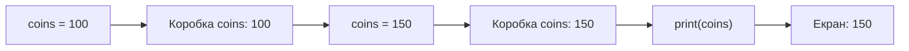

# Урок 1. Змінні та `print()`

**Тривалість:** 30–40 хв  
**Рівень:** Python Rookie  
**XP за урок:** 100

## 🎯 Місія

Навчитися зберігати інформацію у змінних і показувати її на екрані.

Після уроку Марко має вміти:
- створювати змінні;
- зберігати текст і числа;
- змінювати значення змінної;
- виводити значення через `print()`.

---

## 💡 Пояснення простою мовою

Змінна — це **коробка з підписом**. Написи на коробках різні: `name`, `age`, `coins`. Ти кладеш у коробку щось одне — число чи текст — і вона зберігає це, доки ти не покладеш туди щось нове. Якщо покласти нове, старе зникне!

А `print()` — це **чарівний принтер**. Він бере твою коробку, виймає з неї вміст і друкує його на екрані. Ти кажеш принтеру, яку коробку взяти: `print(coins)` — він бере коробку `coins`.

---

## 🧠 1. Що таке змінна

Змінну можна уявити як коробку з підписом.

```python
name = "Marko"
age = 9
coins = 100
```

Тут:
- `name` зберігає `"Marko"`;
- `age` зберігає `9`;
- `coins` зберігає `100`.

Виведемо їх:

```python
print(name)
print(age)
print(coins)
```

---

## 🧪 2. Значення можна змінювати

```python
coins = 100
print(coins)

coins = 150
print(coins)
```

Python виконує код зверху вниз, тому друге значення замінює перше.

Ось як це виглядає на малюнку:



---

## ➕ 3. Математика зі змінними

```python
coins = 100
coins = coins + 50
print(coins)
```

Скорочений запис:

```python
coins += 50
coins -= 20
```

---

## 🧩 Розбираємо по рядках

Візьмемо найважливіші рядки з уроку:

```python
coins = 100      # Кладемо в коробку coins число 100
coins = coins + 50  # Беремо те, що в коробці (100), додаємо 50, кладемо назад
print(coins)     # Принтер друкує те, що тепер у коробці: 150
```

- `coins = 100` — ставимо початкове значення в коробку.
- `coins + 50` — Python спочатку рахує праву частину: 100 + 50 = 150.
- `= ` — кладемо результат 150 назад у коробку. Старе 100 зникає.
- `print(coins)` — показуємо новий вміст коробки: **150**.
- А підказка: `coins += 50` — це короткий спосіб написати `coins = coins + 50`.

---

## ✏️ Вправи

### Вправа 1 — Про себе

Створи змінні:

```python
name = ...
age = ...
favorite_game = ...
```

Виведи їх на екран.

### Вправа 2 — Герой

Створи:

- ім'я героя;
- кількість HP;
- кількість монет;
- damage.

Покажи всі характеристики через `print()`.

### Вправа 3 — Скарб

Герой має 100 монет.

Він:
1. знайшов 50;
2. витратив 30;
3. отримав нагороду 100.

Виведи фінальну кількість монет.

---

## ⭐ Challenge — Character Card

Створи програму, яка виведе приблизно таке:

```text
=== HERO ===
Name: Marko
HP: 100
Damage: 15
Coins: 250
```

Значення повинні зберігатися у змінних.

**+25 XP**, якщо зміниш характеристики героя і програма автоматично покаже нові значення.

---

## 🐞 Debug Challenge

Що не так?

```python
coins = 100
print(Coins)
```

Спробуй пояснити помилку своїми словами.

---

## ⚡ Перевір себе

Перш ніж рухатись далі, перевір себе:

- [ ] Розкажи своїми словами, що таке змінна. (Коробка з підписом!)
- [ ] Що надрукує `print(coins)`, якщо перед ним було `coins = 100`, потім `coins = 150`? (150!)
- [ ] Що робить `coins += 20`? (Додає 20 до поточного значення coins.)
- [ ] Поясни, чому `print(name)` друкує значення, а не слово `name`.

## ✅ Можна рухатись далі, якщо Марко може

- пояснити своїми словами, що таке змінна;
- створити 3–4 змінні без підказки;
- змінити числове значення;
- використати змінну у `print()`.

## 🏠 Домашня місія

Створи файл `hero.py` з карткою власного персонажа.

**Бонус:** додай `level`, `armor` та `magic`.
