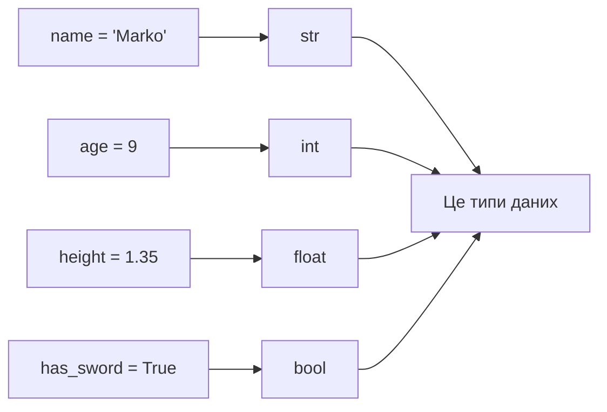
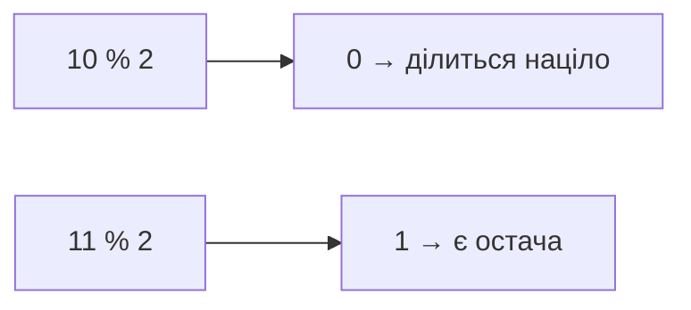

# Урок 2. Типи даних і математика

**Тривалість:** 30–40 хв  
**XP за урок:** 100

## 🎯 Місія

Познайомитися з основними типами даних Python і навчитися виконувати обчислення.

Після уроку Марко має розуміти:
- `str`;
- `int`;
- `float`;
- `bool`;
- основні математичні оператори.

---

## 💡 Пояснення простою мовою

У ліжку зберігання речі мають **типи**: число, текст, правда/неправда. Python теж розкладає дані по «ліжках»-типах:

- `str` — текст (наприклад, `"Marko"`);
- `int` — ціле число (наприклад, `9`);
- `float` — дробове число з комою (наприклад, `1.35`);
- `bool` — `True` або `False`.

Уяви, що це різні **шухляди** в шафі: ти не покладеш текст у шухляду для чисел. А математика — це наче калькулятор: Python вміє `+`, `-`, `*`, `/` і навіть хитрий `%`, який показує остачу від ділення.

---

## 🧠 1. Типи даних

```python
name = "Marko"       # str
age = 9              # int
height = 1.35        # float
has_sword = True     # bool
```

Перевірити тип:

```python
print(type(name))
print(type(age))
```



---

## ➗ 2. Математичні оператори

```python
print(10 + 3)
print(10 - 3)
print(10 * 3)
print(10 / 3)
print(10 // 3)
print(10 % 3)
print(2 ** 3)
```

Спробуй перед запуском передбачити результат кожного рядка.

---

## 🧩 3. Навіщо `%`

Оператор `%` повертає остачу від ділення.

```python
print(10 % 2)
print(11 % 2)
```

Це стане дуже корисним, коли будемо визначати парні та непарні числа.



---

## 🧩 Розбираємо по рядках

```python
print(10 // 3)   # Ціла частина від 10 ÷ 3 = 3
print(10 % 3)    # Остача від 10 ÷ 3 = 1
print(2 ** 3)    # 2 у степені 3 = 2 * 2 * 2 = 8
```

- `//` ділить і **відкидає** решту: 10 ÷ 3 = 3 (а не 3.33).
- `%` ділить і показує лише **остачу**: у 10 вміщується три «трійки» (9), лишається 1.
- `**` — це **степінь**: скільки разів множимо число саме на себе.
- Запам'ятай: `% 2` — класичний спосіб дізнатися, чи число парне. Парне дає 0, непарне — 1.
- Передбач результат кожного рядка **до** запуску — так ти розвиваєш «комп'ютерне мислення».

---

## ✏️ Вправи

### Вправа 1 — Damage

```python
sword_damage = 12
magic_damage = 8
```

Порахуй загальну силу атаки.

### Вправа 2 — Монети

Є 275 монет. Меч коштує 80.

Скільки мечів теоретично можна купити?

Скільки монет залишиться?

### Вправа 3 — Степені

За допомогою `**` порахуй:

- 2²
- 2³
- 5²
- 10³

---

## ⭐ Challenge — Battle Calculator

Є:

```python
enemy_hp = 100
damage = 17
```

Порахуй приблизно, скільки атак потрібно, щоб перемогти ворога.

Підказка: спочатку спробуй звичайне ділення. Що робити, якщо результат не цілий?

---

## 🐞 Debug Challenge

```python
age = "9"
print(age + 1)
```

Запусти код.

1. Яку помилку отримав?
2. Чому?
3. Чим `"9"` відрізняється від `9`?

---

## ⚡ Перевір себе

- [ ] Назви 4 типи даних і наведи приклад для кожного.
- [ ] Що надрукує `print(10 % 2)`? А `print(9 % 2)`? Поясни чому.
- [ ] Чим відрізняються `10 / 3`, `10 // 3` і `10 % 3`?
- [ ] Чим `"10"` (текст) відрізняється від `10` (число)?

## ✅ Можна рухатись далі, якщо Марко може

- назвати 4 базові типи;
- пояснити різницю між `"10"` і `10`;
- користуватися `+`, `-`, `*`, `/`, `//`, `%`, `**`;
- самостійно порахувати результат за допомогою змінних.

## 🏠 Домашня місія

Зроби `shop.py` — невеликий калькулятор магазину:

- у героя є певна кількість монет;
- є ціна меча;
- є ціна щита;
- програма рахує вартість покупки та залишок.
