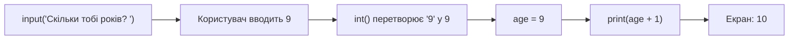

# Урок 3. `input()` і перетворення типів

**Тривалість:** 35–45 хв  
**XP за урок:** 120

## 🎯 Місія

Навчити програму ставити запитання користувачу.

---

## 💡 Пояснення простою мовою

`input()` — це наче **воротар біля брами**: він ставить запитання, чекає на відповідь і передає її твоїй програмі. Що б користувач не написав, воротар завжди повертає **текст** (тип `str`).

Але часто нам потрібне число! Тоді на допомогу приходить **перекладач**: `int()` перетворює текст у ціле число, а `float()` — у дробове. Це як перекласти «дев'ять» у `9`, щоб Python міг це порахувати.

---

## 🧠 1. `input()`

```python
name = input("Як тебе звати? ")
print("Привіт,", name)
```

`input()` завжди повертає текст — `str`.

Навіть якщо користувач вводить число.

---

## 🔢 2. Перетворення у число

```python
age = int(input("Скільки тобі років? "))
print(age + 1)
```

Для дробових чисел:

```python
height = float(input("Твій зріст у метрах: "))
```

---

## ✨ 3. f-string

Зручно вставляти змінні у текст:

```python
name = "Marko"
coins = 150

print(f"{name} має {coins} монет.")
```

Ось весь шлях даних у програмі:



---

## 🧩 Розбираємо по рядках

```python
age = int(input("Скільки тобі років? "))
print(age + 1)
```

- `input("Скільки тобі років? ")` — програма ставить запитання і отримує текст, наприклад `"9"`.
- `int(...)` — перекладає цей текст у число `9`.
- `age = ...` — кладемо число у змінну `age`.
- `print(age + 1)` — тепер Python справді може рахувати: `9 + 1 = 10`.
- Якби ми забули `int()`, Python намагався б додати текст `"9"` + число 1 — і це дало б помилку!

---

## ✏️ Вправи

### Вправа 1 — Привітання

Запитай ім'я і вік.

Виведи:

```text
Привіт, Marko! Тобі 9 років.
```

### Вправа 2 — Через 10 років

Запитай вік.

Покажи, скільки буде років через 10 років.

### Вправа 3 — Калькулятор

Запитай два числа і виведи:

- суму;
- різницю;
- добуток.

---

## ⭐ Challenge — Hero Creator

Програма має запитати:

- ім'я героя;
- HP;
- damage;
- кількість монет.

Потім показати:

```text
=== YOUR HERO ===
Name: Marko
HP: 100
Damage: 15
Coins: 250
```

---

## 🐞 Debug Challenge

```python
number = input("Введи число: ")
print(number + 10)
```

Чому цей код не працює так, як очікується?

Виправ його.

---

## ⚡ Перевір себе

- [ ] Що повертає `input()` — текст чи число? (Завжди текст!)
- [ ] Коли потрібен `int()`, а коли `float()`?
- [ ] Чому `int(input(...))` рахує, а просто `input(...)` — ні?
- [ ] Розкажи своїми словами, що робить `f"{name} має {coins} монет."`.

## ✅ Можна рухатись далі, якщо Марко може

- використовувати `input()`;
- пояснити, що `input()` повертає `str`;
- застосувати `int()` і `float()`;
- створити простий інтерактивний калькулятор.

## 🏠 Домашня місія

Створи `character_creator.py`.

**Бонус:** додай улюблену зброю і рівень героя.
