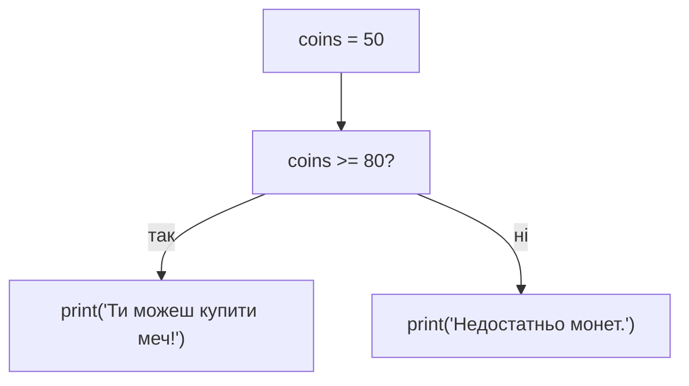

# Урок 4. Порівняння та `if`

**Тривалість:** 35–45 хв  
**XP за урок:** 130

## 🎯 Місія

Навчити програму приймати рішення.

---

## 💡 Пояснення простою мовою

`if` — це **варта біля дверей**: вона перевіряє умову і, якщо вона правдива, дозволяє пройти (виконати код). Якщо ні — зупиняє.

З `else` це стає **розвилка на стежці**: дійшов до розвилки, і є два шляхи — «так» йдеш одним, «ні» — іншим. Обидва шляхи є, але ти завжди проходиш лише одним!

А щоб перевіряти, нам потрібні **знаки порівняння**: `>` (більше), `<` (менше), `>=` (більше або рівно), `==` (дорівнює). Результат — завжди `True` або `False`.

---

## 🧠 1. Порівняння

```python
print(10 > 5)
print(10 < 5)
print(10 == 10)
print(10 != 5)
print(10 >= 10)
print(5 <= 10)
```

Результат — `True` або `False`.

Зверни увагу:

```python
x = 10
```

означає присвоєння.

А:

```python
x == 10
```

означає перевірку.

---

## 🚪 2. `if`

```python
age = 9

if age >= 8:
    print("Доступ дозволено!")
```

Відступи у Python дуже важливі.

---

## 🔀 3. `if` + `else`

```python
coins = 50

if coins >= 80:
    print("Ти можеш купити меч!")
else:
    print("Недостатньо монет.")
```

Це розвилка рішень:



---

## 🧩 Розбираємо по рядках

```python
if coins >= 80:
    print("Ти можеш купити меч!")
else:
    print("Недостатньо монет.")
```

- `if coins >= 80:` — ставимо запитання: «Чи монет 80 або більше?»
- Якщо **так** (True) — виконуємо рядки під `if`.
- `else:` — «а якщо ні» — йдемо сюди, коли умова хибна.
- Зверни увагу: код усередині має **відступ** (зсув праворуч). Без нього Python не зрозуміє, який код належить `if`.
- Умова `>=` — це «більше або дорівнює». А `=` (одна риска) — це присвоєння, а не перевірка!

---

## ✏️ Вправи

### Вправа 1 — Достатньо HP?

Якщо HP героя більше 0 — покажи `"Герой живий"`.

Інакше — `"Game Over"`.

### Вправа 2 — Парне чи непарне

Запитай число.

Підказка:

```python
number % 2
```

### Вправа 3 — Магазин

Запитай кількість монет.

Меч коштує 100.

Скажи, чи може гравець його купити.

---

## ⭐ Challenge — Secret Door

Програма запитує код.

Якщо код дорівнює `1234`, показує:

```text
Двері відкрилися!
```

Інакше:

```text
Неправильний код.
```

---

## 🐞 Debug Challenge

```python
coins = 100

if coins = 100:
    print("Можна купити меч")
```

Знайди помилку.

---

## ⚡ Перевір себе

- [ ] Поясни різницю між `=` і `==`.
- [ ] Якою буде відповідь на `10 >= 10`? А на `10 > 10`?
- [ ] Розкажи, що станеться, якщо `coins = 50` і код `if coins >= 80: ... else: ...` — який шлях він обере?
- [ ] Навіщо потрібен відступ після `if`?

## ✅ Можна рухатись далі, якщо Марко може

- пояснити `==` і `=`;
- використовувати `>`, `<`, `>=`, `<=`, `!=`;
- самостійно написати `if/else`;
- правильно робити відступи.

## 🏠 Домашня місія

Напиши `age_checker.py`, який питає вік і повідомляє, чи користувач старший або молодший за 10 років.
