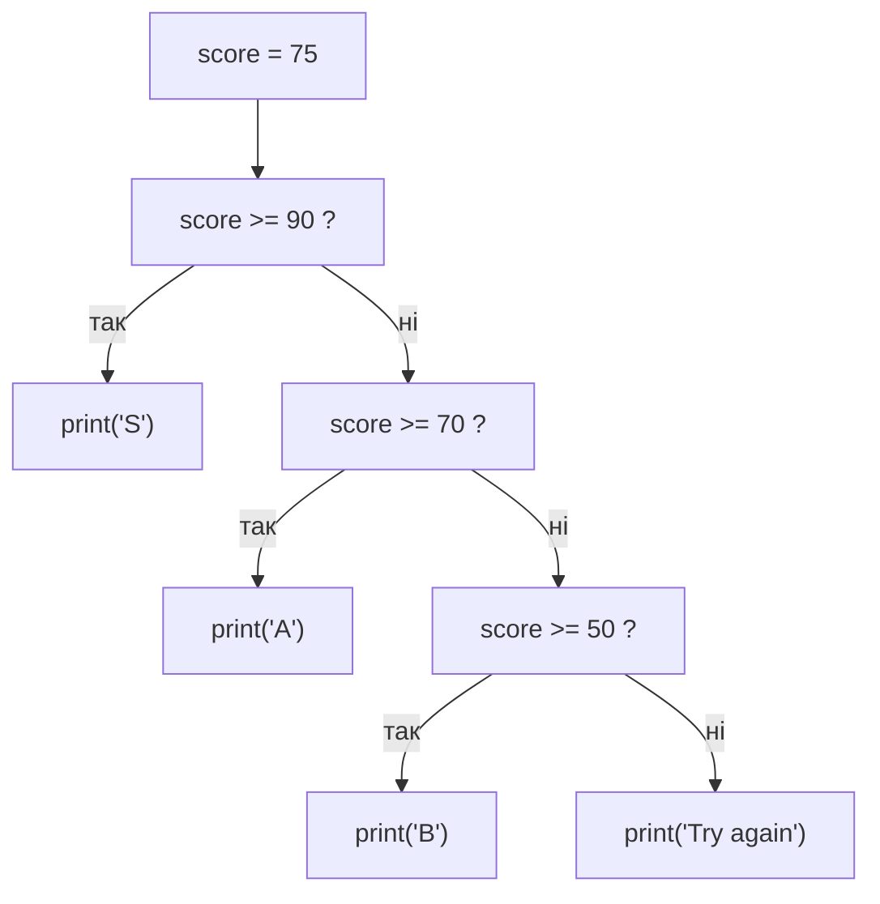

# Урок 5. `elif`, `and`, `or`, `not`

**Тривалість:** 35–45 хв  
**XP за урок:** 140

## 🎯 Місія

Навчитися створювати складніші рішення.

---

## 💡 Пояснення простою мовою

`elif` — це **драбина рішень**. Уяви сходинки: спочатку перевіряємо найважливішу умову. Якщо вона хибна — спускаємось на сходинку нижче і перевіряємо наступну. Як тільки якась умова виявилась правдивою, Python зупиняється і не дивиться далі.

`and` — це **два замки на одних дверях**: щоб відчинити, потрібні обидва ключі. `or` — **два запасні ключі**: достатньо лише одного. А `not` — це **перевертальник**: перетворює `True` на `False` і навпаки.

---

## 🧠 1. `elif`

```python
score = 75

if score >= 90:
    print("S")
elif score >= 70:
    print("A")
elif score >= 50:
    print("B")
else:
    print("Try again")
```

Python перевіряє умови зверху вниз.



---

## 🔗 2. `and`

Обидві умови мають бути правдивими.

```python
level = 5
coins = 200

if level >= 5 and coins >= 100:
    print("Можна купити магічний меч!")
```

---

## 🔀 3. `or`

Достатньо хоча б однієї правдивої умови.

```python
has_key = False
has_magic = True

if has_key or has_magic:
    print("Двері відкрито.")
```

---

## 🚫 4. `not`

```python
game_over = False

if not game_over:
    print("Гра продовжується!")
```

---

## 🧩 Розбираємо по рядках

```python
if level >= 5 and coins >= 100:
    print("Можна купити магічний меч!")
```

- `level >= 5 and coins >= 100` — це **одна** умова, складена з двох.
- Завдяки `and` **обидві** частини мають бути правдивими, щоб увійти в блок.
- Якщо хоча б одна хибна — умова в цілому хибна, і блок не виконається.
- `and` «жорсткіший», ніж `or`: `or` задовольняється однією правдивою частиною.
- `not` у прикладі вище перевертає результат: якщо `game_over = False`, то `not game_over` стає `True`.

---

## ✏️ Вправи

### Вправа 1 — Рівні HP

- HP > 70 → `"Сильний"`
- HP > 30 → `"Поранений"`
- інакше → `"Небезпека!"`

### Вправа 2 — Вхід у замок

Для входу потрібно:

- level >= 5;
- є ключ.

### Вправа 3 — Дощ

Якщо є парасоля **або** немає дощу — можна йти гуляти.

---

## 🐉 BOSS LEVEL 1 — Adventure Gate

Створи програму.

Користувач вводить:
- `level`;
- кількість `coins`;
- чи має ключ (`yes/no`).

Правила:

- якщо level >= 5 **і** є ключ → `"Ти увійшов у замок!"`;
- якщо немає ключа, але coins >= 100 → `"Ти купив ключ і увійшов!"`;
- інакше → `"Вхід закритий."`

**Boss reward: +100 XP**

---

## ⚡ Перевір себе

- [ ] Поясни різницю між `and` і `or` своїми словами.
- [ ] Чи виконається код, якщо `level = 3` і `coins = 150` за умови `level >= 5 and coins >= 100`? (Ні!)
- [ ] Що зробить `not True`? А `not False`?
- [ ] У якому порядку Python перевіряє умови в ланцюжку `elif`? (Зверху вниз, зупиняється на першій правдивій.)

## ✅ Можна рухатись далі, якщо Марко може

- використовувати `elif`;
- пояснити різницю між `and` і `or`;
- комбінувати кілька умов;
- читати логіку програми зверху вниз.

## 🏠 Домашня місія

Зроби `grade_game.py`, який за кількістю очок визначає ранг гравця.
