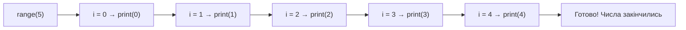

# Урок 6. Цикл `for` і `range()`

**Тривалість:** 35–45 хв  
**XP за урок:** 140

## 🎯 Місія

Навчити Python повторювати команди.

---

## 💡 Пояснення простою мовою

Цикл `for` — це наче **піаніно з нотами**. Уяви нотний ряд: кожна нота (число з `range()`) звучить по черзі, одна за одною. `for` бере кожну ноту, «грає» її (виконує команди всередині) і переходить до наступної.

`range(5)` — це наче **5 тактів**: спочатку 0, потім 1, 2, 3, 4. `range(1, 6)` — починаємо з 1 до 5 (кінець не враховується!). А третє число — це **крок**: наскільки великими стрибками йдемо (наприклад, `range(0, 11, 2)` — парні числа).

---

## 🔁 1. Простий `for`

```python
for i in range(5):
    print("Hello")
```

Команда виконається 5 разів.

---

## 🔢 2. Значення `i`

```python
for i in range(5):
    print(i)
```

Результат:

```text
0
1
2
3
4
```

Уяви, як цикл крокує по числах:



---

## 🛣 3. `range(start, stop)`

```python
for i in range(1, 6):
    print(i)
```

Отримаємо числа від 1 до 5.

---

## 🪜 4. Крок

```python
for i in range(0, 11, 2):
    print(i)
```

---

## 🧩 Розбираємо по рядках

```python
for i in range(1, 6):
    print(i)
```

- `for i in` — каже Python: «для кожного числа i у наборі далі виконай команди».
- `range(1, 6)` — набір чисел **від 1 до 5** (кінцеве 6 не входить!).
- Перше число — початок, друге — кінець (не включно), третє — крок.
- `print(i)` — цей рядок виконується для **кожного** значення i.
- Тіло циклу (відступлений код) повторюється стільки разів, скільки чисел у `range()`.

---

## ✏️ Вправи

### Вправа 1

Виведи числа від 1 до 10.

### Вправа 2

Виведи парні числа від 2 до 20.

### Вправа 3

Виведи числа від 10 до 1 у зворотному порядку.

Підказка: крок може бути `-1`.

### Вправа 4 — Таблиця множення

```python
number = 7
```

Покажи таблицю множення від `7 × 1` до `7 × 10`.

---

## ⭐ Challenge — Attack Combo

Герой робить 5 атак.

```python
damage = 12
```

Після кожної атаки виводь номер атаки та damage:

```text
Attack 1: 12 damage
Attack 2: 12 damage
...
```

В кінці порахуй загальний damage.

---

## 🐞 Debug Challenge

Чому цей код виводить лише 1–9?

```python
for i in range(1, 10):
    print(i)
```

---

## ⚡ Перевір себе

- [ ] Що надрукує `for i in range(3): print(i)`? (0, 1, 2!)
- [ ] Які числа дасть `range(2, 6)`? (2, 3, 4, 5 — кінець не враховуємо!)
- [ ] Як отримати парні числа від 2 до 10? (Підказка: крок 2.)
- [ ] Поясни, чому в `range(1, 11)` числа закінчуються на 10, а не на 11.

## ✅ Можна рухатись далі, якщо Марко може

- самостійно написати `for`;
- пояснити `range()`;
- використати початок, кінець і крок;
- написати таблицю множення.

## 🏠 Домашня місія

Зроби `countdown.py`:

```text
10
9
8
...
1
GO!
```
