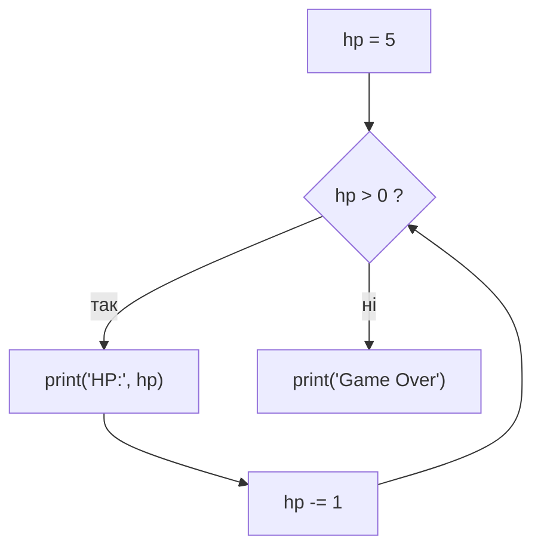

# Урок 7. Цикл `while`

**Тривалість:** 35–45 хв  
**XP за урок:** 150

## 🎯 Місія

Навчитися повторювати код, поки певна умова залишається правдивою.

---

## 💡 Пояснення простою мовою

`while` — це **лічильник-сирена**, який працює, поки триває «тривога». Умова — це вимикач: доки вона правдива (True), Python крутить одну й ту саму дію. Щойно умова стала хибною (False) — сирена вимикається, і код іде далі.

А `break` — це **червона кнопка** всередині циклу: коли її натискають, цикл миттєво зупиняється, хоч би якою була умова. Зручно, коли хочеш зупинитись одразу, як отримав правильну відповідь.

Але увага: якщо змінна всередині `while` ніколи не змінюється, цикл крутиться **вічно**! Це називається нескінченним циклом.

---

## 🧠 1. `while`

```python
hp = 5

while hp > 0:
    print("HP:", hp)
    hp -= 1

print("Game Over")
```

Як це працює крок за кроком:



---

## ⚠️ 2. Нескінченний цикл

```python
x = 1

while x < 10:
    print(x)
```

Що тут не так?

`x` ніколи не змінюється.

Правильно:

```python
x = 1

while x < 10:
    print(x)
    x += 1
```

---

## 🛑 3. `break`

```python
while True:
    password = input("Password: ")

    if password == "python":
        print("Correct!")
        break
```

---

## 🧩 Розбираємо по рядках

```python
while True:
    password = input("Password: ")

    if password == "python":
        print("Correct!")
        break
```

- `while True:` — кнопка «працювати завжди», умова ніколи не стає хибною сама.
- Тому ми **самі** маємо зупинити цикл за допомогою `break`.
- `password = input("Password: ")` — питаємо пароль у користувача.
- `if password == "python":` — перевіряємо, чи пароль правильний.
- Якщо так — друкуємо `"Correct!"` і натискаємо `break`, що миттєво вимикає цикл.
- Якби не було `break`, цикл питав би пароль нескінченно!

---

## ✏️ Вправи

### Вправа 1

Виведи числа 1–10 через `while`.

### Вправа 2

Зроби countdown 10–1 через `while`.

### Вправа 3 — Password

Питай пароль, доки користувач не введе правильний.

---

## ⭐ Challenge — Monster Battle

```python
monster_hp = 50
damage = 8
```

Герой атакує монстра, поки `monster_hp > 0`.

Після кожної атаки показуй HP монстра.

Не дозволяй HP у фінальному повідомленні виглядати як `-6`. Подумай, як це можна акуратно показати.

---

## 🧠 `for` чи `while`?

`for` зручний, коли ми приблизно знаємо **скільки разів** повторити дію.

`while` — коли повторення залежить від **умови**.

---

## 🐞 Debug Challenge

```python
energy = 10

while energy > 0:
    print("Running...")
    energy + 1
```

Знайди дві логічні проблеми.

---

## ⚡ Перевір себе

- [ ] Розкажи, коли зручно використати `for`, а коли `while`.
- [ ] Що таке нескінченний цикл і як його уникнути?
- [ ] Що робить `break`? Чи обов'язково він потрібен у `while`?
- [ ] Скільки разів виконається тіло циклу, якщо `hp = 5` і всередині є `hp -= 1`, поки `hp > 0`?

## ✅ Можна рухатись далі, якщо Марко може

- написати `while`;
- уникнути нескінченного циклу;
- використати `break`;
- пояснити, коли краще `for`, а коли `while`.

## 🏠 Домашня місія

Створи гру `guess_password.py` з необмеженою кількістю спроб.
