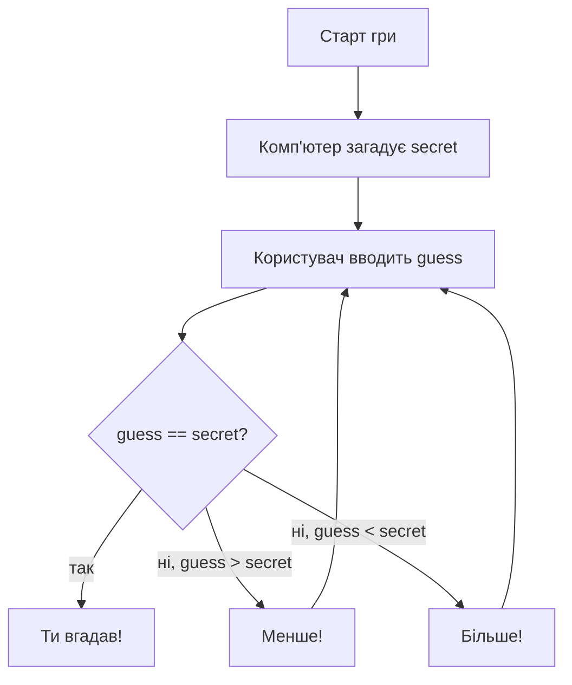

# Урок 8. Модуль `random` і гра «Вгадай число»

**Тривалість:** 40–50 хв  
**XP за урок:** 170

## 🎯 Місія

Об'єднати змінні, `input`, умови та цикл у справжню гру.

### 💡 Пояснення простою мовою

Уяві, що ти кидаєш кубик — кожного разу випадає інше число. Саме так працює модуль `random` у Python: він генерує випадкові числа, які ми не можемо передбачити.

Гра «Вгадай число» працює так: комп'ютер загадує число (ніхто не знає яке), а ти намагаєшся вгадати. Після кожного твого кидка програма підказує — більше чи менше твоє число. Так триває, доки не вгадаєш!

---

## 🎲 1. `random`

```python
import random

number = random.randint(1, 10)
print(number)
```

`randint(1, 10)` генерує випадкове ціле число від 1 до 10 включно.

---

## 🧪 2. Випадковий damage

```python
import random

damage = random.randint(5, 20)
print(f"Attack: {damage} damage")
```

---

## ✏️ Вправи

### Вправа 1 — Dice

Зімітуй шестигранний кубик.

### Вправа 2 — Critical Hit

Згенеруй damage від 5 до 20.

Якщо damage >= 18, додатково покажи:

```text
CRITICAL HIT!
```

### Вправа 3 — 5 атак

За допомогою `for` зроби 5 випадкових атак.

---

## 🎮 Головний проєкт — Guess the Number

Комп'ютер загадує число від 1 до 20.

Користувач вгадує.

Програма підказує:

- `"Більше!"`
- `"Менше!"`
- `"Ти вгадав!"`

Каркас:

```python
import random

secret = random.randint(1, 20)

while True:
    guess = int(input("Твоя відповідь: "))

    # твій код тут
```



### 🧩 Розбираємо по рядках

- `import random` — підключаємо модуль для випадкових чисел.
- `secret = random.randint(1, 20)` — комп'ютер загадує число від 1 до 20.
- `while True:` — нескінченний цикл, гра триває доки не вгадаєш.
- `guess = int(input(...))` — запитуємо число у користувача і перетворюємо на ціле.
- `if secret > guess:` — порівнюємо і підказуємо більше чи менше.
- `if secret == guess:` — якщо рівні — гравець виграв, і `break` зупиняє цикл.

Не копіюй готове рішення — допиши логіку самостійно.

---

## ⭐ Challenge

Додай лічильник спроб.

Наприкінці:

```text
Ти вгадав за 4 спроби!
```

**Mega bonus:** максимум 6 спроб. Після цього — Game Over.

---

## 🐉 BOSS LEVEL 2

Без підглядання створити гру заново у новому порожньому файлі.

Умови:
- випадкове число 1–50;
- підказки більше/менше;
- лічильник спроб;
- повідомлення про перемогу.

**Boss reward: +150 XP**

---

## ⚡ Перевір себе

- [ ] Чи можеш пояснити, що робить `random.randint(1, 20)`?
- [ ] Чи розуміш, навіщо `while True:` і `break`?
- [ ] Чи вмієш додати лічильник спроб до гри?
- [ ] Чи можеш створити гру без підглядання в цьому уроці?

---

## ✅ Можна рухатись далі, якщо Марко може

- імпортувати `random`;
- використати `randint`;
- поєднати `while`, `if` і `input`;
- самостійно написати просту гру.

## 🏠 Домашня місія

Додай рівні складності:

- easy: 1–10;
- normal: 1–50;
- hard: 1–100.
