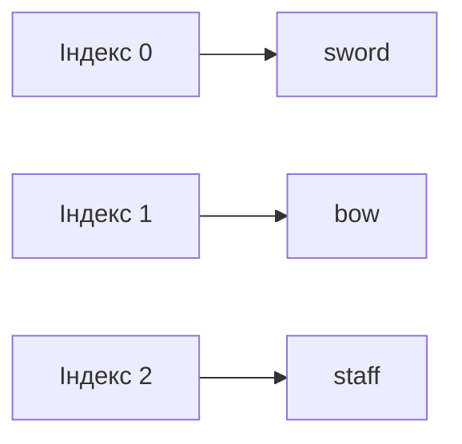

# Урок 9. Рядки та списки

**Тривалість:** 40–50 хв  
**XP за урок:** 170

## 🎯 Місія

Навчитися зберігати багато значень разом.

### 💡 Пояснення простою мовою

**Рядок** — це як намисто з намистин-символів. Кожна літера, цифра чи знак — це намистина, яка має свій номер (індекс). Наприклад, у слові "Marko" літера "M" має номер 0, "a" — номер 1, і так далі.

**Список** — це як рюкзак або коробка з поличками, де кожен предмет має свій номер-полицю. Ти можеш додавати нові предмети (`.append()`), забирати зайві (`.remove()`) і переглядати, що там є.

Важливо: номери поличок (індекси) починаються з **0**, а не з 1!

---

## 📝 1. Рядки

```python
name = "Marko"

print(name[0])
print(len(name))
print(name.upper())
print(name.lower())
```

Індекси починаються з `0`.

---

## 📦 2. Списки

```python
weapons = ["sword", "bow", "staff"]
```

Отримати елемент:

```python
print(weapons[0])
print(weapons[1])
```



---

## ➕ 3. Додаємо та видаляємо

```python
weapons.append("axe")
weapons.remove("bow")

print(weapons)
```

---

## 🔁 4. Перебираємо список

```python
weapons = ["sword", "bow", "staff"]

for weapon in weapons:
    print(weapon)
```

### 🧩 Розбираємо по рядках

- `weapons = ["sword", "bow", "staff"]` — створюємо список із трьох елементів.
- `for weapon in weapons:` — цикл проходить через кожен елемент списку.
- На кожній ітерації змінна `weapon` містить поточний елемент.
- `print(weapon)` — виводить його на екран.
- Спочатку буде "sword", потім "bow", потім "staff".

---

## ✏️ Вправи

### Вправа 1 — Inventory

Створи список із 5 предметів героя.

Виведи кожен через `for`.

### Вправа 2

Додай новий предмет за допомогою `.append()`.

### Вправа 3

Покажи кількість предметів:

```python
len(inventory)
```

### Вправа 4

Запитай у користувача предмет і додай його до inventory.

---

## ⭐ Challenge — Random Loot

```python
import random

loot = ["sword", "shield", "potion", "gold", "magic ring"]
```

Вибери випадковий предмет:

```python
item = random.choice(loot)
```

Покажи:

```text
You found: magic ring
```

Додай знайдений предмет до inventory.

---

## 🧠 Додатково: `in`

```python
if "sword" in inventory:
    print("У тебе є меч!")
```

---

## 🐞 Debug Challenge

```python
items = ["sword", "shield", "potion"]
print(items[3])
```

Чому виникає помилка?

---

## ⚡ Перевір себе

- [ ] Чи можеш пояснити, що таке індекс і з чого він починається?
- [ ] Чи вмієш додавати та видаляти елементи зі списку?
- [ ] Чи розуміш, як працює цикл `for` зі списком?
- [ ] Чи можеш перевірити, чи є елемент у списку, за допомогою `in`?

---

## ✅ Можна рухатись далі, якщо Марко може

- пояснити, що таке список;
- працювати з індексами;
- використовувати `append`, `remove`, `len`;
- перебирати список циклом;
- використовувати `in`.

## 🏠 Домашня місія

Зроби `inventory.py`:

1. стартовий список;
2. знайди 3 випадкові предмети;
3. додай їх;
4. виведи весь inventory.
