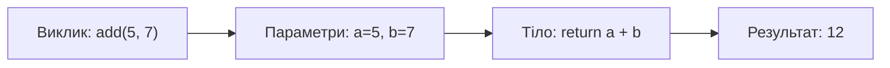

# Урок 10. Функції

**Тривалість:** 45–55 хв  
**XP за урок:** 200

## 🎯 Місія

Навчитися створювати власні команди в Python.

Це одна з найважливіших тем у програмуванні.

---

## 🧠 1. Навіщо потрібні функції

Без функції:

```python
print("==========")
print("HERO")
print("==========")

print("==========")
print("MONSTER")
print("==========")
```

Ми повторюємо код.

З функцією:

```python
def print_title(text):
    print("==========")
    print(text)
    print("==========")

print_title("HERO")
print_title("MONSTER")
```

---

## 🛠 2. Створення функції

```python
def say_hello():
    print("Hello!")

say_hello()
```

`def` означає: «створи функцію».

---

## 📥 3. Параметри

```python
def greet(name):
    print(f"Hello, {name}!")

greet("Marko")
greet("Alex")
```

---

## 📤 4. `return`

Функція може повернути результат:

```python
def add(a, b):
    return a + b

result = add(5, 7)
print(result)
```



---

## 🎮 5. Практичний розібраний приклад — Adventure Game

**Завдання:** Створи гру, де герой отримує дараунки з скринь.

**Розбір:** Подивимось, як це робити з функціями:

```python
import random

def show_hero_stats(name, hp, coins):
    """Показує статистику героя"""
    print(f"\n⚔️ Герой: {name}")
    print(f"❤️ HP: {hp}")
    print(f"🪙 Монети: {coins}\n")

def open_chest():
    """Відкриває скриню і повертає випадкову нагороду"""
    treasures = ["100 монет", "50 монет", "зелля здоров'я", "магічний меч", "10 монет"]
    treasure = random.choice(treasures)
    return treasure

def use_potion(hp):
    """Використовує зілля, повертає нове HP"""
    if hp < 100:
        new_hp = hp + 50
        print(f"✨ Ти використав зілля! HP тепер: {new_hp}")
        return new_hp
    else:
        print("⚠️ Твоє HP вже максимальне!")
        return hp

# Тепер гра:
hero_name = "Марко"
hero_hp = 100
hero_coins = 50

show_hero_stats(hero_name, hero_hp, hero_coins)

# Першу скриню
print("🎁 Ти відкрив скриню!")
reward = open_chest()
print(f"Ти отримав: {reward}")

if reward == "зілля здоров'я":
    hero_hp = use_potion(hero_hp)
elif "монет" in reward:
    coins_found = int(reward.split()[0])
    hero_coins += coins_found
    print(f"💰 Твоє золото тепер: {hero_coins}")

show_hero_stats(hero_name, hero_hp, hero_coins)
```

**Як це працює:**
- 🔸 Функція `show_hero_stats()` — показує інформацію
- 🔸 Функція `open_chest()` — вибирає випадкову нагороду
- 🔸 Функція `use_potion()` — збільшує HP
- 🔸 Програма викликає ці функції кілька разів

---

## ✏️ Практичні задачки

### 📌 Задача 1 — Меню закуски 🍕

**Легко:**

Створи функцію `order_pizza`, яка приймає назву піци і розраховує ціну:
- Маргарита: 150 грн
- Пепероні: 180 грн
- Гавайська: 200 грн

```python
def order_pizza(name):
    prices = {"Маргарита": 150, "Пепероні": 180, "Гавайська": 200}
    # Допишіть функцію
    # return ...

print(order_pizza("Пепероні"))  # 180
```

**Що повинно вивести:** `180`

---

### 📌 Задача 2 — Перевіра віку 🎂

**Легко:**

Створи функцію `is_adult`, яка перевіряє, чи людина дорослої (18+ років).

```python
def is_adult(age):
    # Твій код тут

print(is_adult(25))  # True
print(is_adult(10))  # False
```

**Вказівка:** Використай `return` і оператор `>`.

---

### 📌 Задача 3 — Таблиця множення ⏱️

**Середньо:**

Створи функцію `multiplication_table`, яка виводить таблицю множення на число:

```python
def multiplication_table(number):
    # Твій код тут
    # Виведи: число × 1, число × 2, ... число × 10

multiplication_table(3)
```

**Повинно вивести:**
```
3 × 1 = 3
3 × 2 = 6
3 × 3 = 9
...
3 × 10 = 30
```

**Вказівка:** Використай цикл `for`.

---

### 📌 Задача 4 — Лічильник слів 📝

**Середньо:**

Створи функцію `count_words`, яка рахує слова в реченні:

```python
def count_words(sentence):
    # Твій код тут

text = "Я люблю грати у відеоігри"
print(count_words(text))  # 5
```

**Вказівка:** Реченням можна розділити методом `.split()`.

---

### 📌 Задача 5 — Кешкова гра 🎲

**Важко:**

Створи гру «Вгадай число». Гральник має 3 спроби.

```python
import random

def play_guess_game():
    secret_number = random.randint(1, 10)
    attempts = 3
    
    # Допишіть гру:
    # 1. Запитайте число у гральника
    # 2. Якщо правильно — вивести "Ура! Ти вгадав!"
    # 3. Якщо більше — "Число менше"
    # 4. Якщо менше — "Число більше"
    # 5. Якщо спроби закінчилися — "Ти програв! Число було: X"

play_guess_game()
```

---

### 📌 Задача 6 — Калькулятор з функціями 🧮

**Важко:**

Створи функції для базових операцій:

```python
def add(a, b):
    return a + b

def subtract(a, b):
    # Твій код

def multiply(a, b):
    # Твій код

def divide(a, b):
    if b == 0:
        return "Не можна ділити на 0!"
    return a / b

# Тепер використай функції:
print(add(10, 5))       # 15
print(subtract(10, 5))  # 5
print(multiply(10, 5))  # 50
print(divide(10, 5))    # 2.0
```

---

### 📌 Задача 7 — Лист покупок 🛒

**Важко:**

Створи функції для управління списком покупок:

```python
shopping_list = []

def add_item(item):
    # Додай предмет до списку

def remove_item(item):
    # Видали предмет зі списку

def show_list():
    # Виведи весь список

# Використання:
add_item("Хліб")
add_item("Молоко")
add_item("Сир")
show_list()
# Виведе:
# 1. Хліб
# 2. Молоко
# 3. Сир

remove_item("Молоко")
show_list()
```

---

## ⭐ Challenge — Dice Function

Створи функцію:

```python
def roll_dice():
    ...
```

Вона має повертати випадкове число 1–6.

Виклич її 5 разів.

---

## 🐉 BOSS LEVEL 3 — Battle Simulator

Створи маленький симулятор бою.

Потрібні функції:

```python
def attack():
    ...

def show_hp(name, hp):
    ...
```

Правила:
- герой має HP;
- монстр має HP;
- кожна атака завдає випадковий damage;
- бій триває, доки HP монстра > 0;
- використай хоча б **2 власні функції**.

### Приклад роботи

```text
Dragon HP: 50
Marko attacks for 12!
Dragon HP: 38
Marko attacks for 7!
Dragon HP: 31
...
Dragon defeated!
```

**Boss reward: +200 XP**

---

## 🎯 Як вирішувати задачки

**Крок 1:** Прочитай завдання повільно.

**Крок 2:** Напиши заголовок функції (`def ...`).

**Крок 3:** Напиши простий код всередину.

**Крок 4:** Перевір з прикладом. Працює? Супер! 🎉

**Крок 5:** Якщо не працює, прочитай помилку і спробуй ще раз.

---

## 🧠 Головна ідея

Функція — це не просто новий синтаксис.

Функції допомагають:
- не повторювати код;
- ділити велику програму на маленькі частини;
- давати частинам програми зрозумілі назви;
- повторно використовувати код.

Це перший великий крок до написання справжніх програм.

---

## ⚡ Перевір себе

- [ ] Чи можеш створити просту функцію з `def`, параметром і `return`?
- [ ] Чи розуміш різницю між `print()` і `return`?
- [ ] Чи вмієш викликати функцію та передати їй значення?

---

## ✅ Можна рухатись далі, якщо Марко може

- створити функцію через `def`;
- викликати її;
- передати параметри;
- пояснити різницю між `print()` і `return`;
- розбити невелику програму на 2–3 функції;
- вирішити щонайменше 3 практичні задачки.

## 🏠 Домашня місія

Перероби одну зі старих програм (`guess_number.py`, `inventory.py` або battle simulator), щоб у ній було щонайменше 3 функції.

Або виконай 2-3 практичні задачки з цього урока.

---

# 🏆 Підсумок перших 10 уроків

Після цього етапу Марко вже має знати:

- змінні;
- `str`, `int`, `float`, `bool`;
- `input`;
- арифметику;
- `if / elif / else`;
- `and / or / not`;
- `for`;
- `while`;
- `random`;
- рядки;
- списки;
- базові функції.

Наступний логічний блок:

**словники → вкладені структури → робота з файлами → exceptions → модулі → більші проєкти → OOP.**
