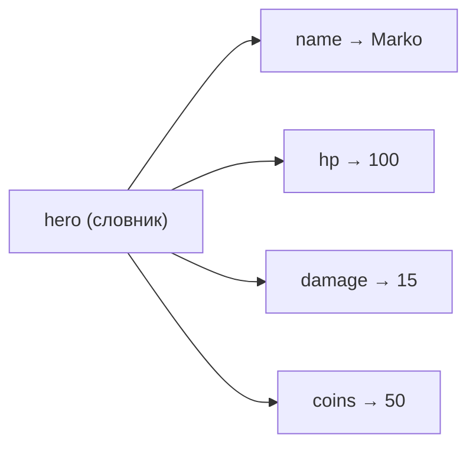

# Урок 11. Словники `dict`

**Тривалість:** 40–50 хв  
**XP:** 170

## 🎯 Місія
Навчитися зберігати пов'язані дані у форматі **ключ → значення**.

## 💡 Пояснення простою мовою
**Словник** — це блокнот з ярликами. Кожен ярлик (ключ) веде до певного значення. Наприклад, у записнику є ярлик «Ім'я» → «Marko», «HP» → 100. На відміну від списку, де все за номерами (перший, другий, третій), тут ти звертаєшся за назвою: `hero["name"]`. Це зручно, бо не треба пам'ятати номери — достатньо знати ім'я ярлика.



## 🧠 Словник героя
```python
hero = {
    "name": "Marko",
    "hp": 100,
    "damage": 15,
    "coins": 50
}
print(hero["name"])
print(hero["hp"])
```

Зміна й додавання:
```python
hero["hp"] = 80
hero["level"] = 2
```

Перебір:
```python
for key, value in hero.items():
    print(key, "=", value)
```

## 🧩 Розбираємо по рядках
```python
hero = {                          # Створюємо словник (фігурні дужки {})
    "name": "Marko",              # Ключ "name" → значення "Marko"
    "hp": 100,                    # Ключ "hp" → значення 100
    "damage": 15,                 # Ключ "damage" → значення 15
    "coins": 50                   # Ключ "coins" → значення 50
}
print(hero["name"])               # Беремо значення за ключем "name"
print(hero["hp"])                 # Беремо значення за ключем "hp"
hero["hp"] = 80                   # Змінюємо значення ключа "hp"
hero["level"] = 2                 # Додаємо новий ключ "level"
for key, value in hero.items():   # Перебираємо всі пари ключ-значення
    print(key, "=", value)        # Виводимо: name = Marko, hp = 80, ...
```

> 💡 Якщо ключа немає у словнику, `hero["xp"]` викликає помилку. Безпечніший спосіб — використовувати `.get()`, який повертає `None` або значення за замовчуванням:
> ```python
> print(hero.get("xp"))           # None (без помилки!)
> print(hero.get("xp", 0))        # 0 (замовчування)
> ```

## ✏️ Вправи
1. Створи словник героя: `name`, `hp`, `damage`, `level`, `weapon`.
2. Зменш HP на 25.
3. Збільш level на 1 і damage на 5.
4. Перевір `if "weapon" in hero:`.

## ⭐ Challenge — Game Shop
```python
shop = {"sword": 100, "shield": 80, "potion": 25}
```
Покажи товари й ціни циклом. Потім запитай назву товару і покажи ціну.

## 🐞 Debug Challenge
```python
hero = {"name": "Marko", "hp": 100}
print(hero["damage"])
```
Що станеться і чому?

## ✅ Готовий далі, якщо
- розуміє різницю між `list` і `dict`;
- читає, змінює й додає значення;
- використовує `.items()`.

## ⚡ Перевір себе
- Чи можна використовувати `hero["hp"]` для списку? (Підказка: ні!)
- Що станеться, якщо написати `hero["xp"]`, а такого ключа немає?
- Чим `hero.items()` відрізняється від `hero.keys()`?
- Як перевірити, чи є ключ у словнику, перш ніж до нього звертатися?

## 🏠 Домашня місія
Перероби персонажа так, щоб усі його характеристики зберігались в одному словнику.
