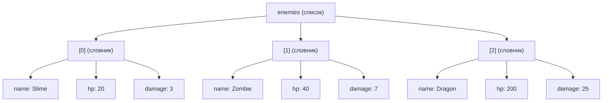

# Урок 12. Вкладені списки та словники

**Тривалість:** 45–55 хв  
**XP:** 180

## 🎯 Місія
Навчитися працювати зі списками словників і словниками, які містять списки.

## 💡 Пояснення простою мовою
Уявіть **коробки в коробках**. Є коробка «Будинок», у ній — коробки «Кімната1», «Кімната2», а в кожній кімнаті — коробки «Меблі», «Речі». Так само працюють вкладені структури: є список `enemies`, у кожному елементі — словник з ключами `name`, `hp`, `damage`. Щоб дістатися до потрібного значення, спочатку береш елемент за номером, а потім — за ключем.



## 🧩 Розбираємо по рядках
```python
enemies = [                        # Створюємо СПИСОК (квадратні дужки [])
    {"name": "Slime", "hp": 20, "damage": 3},   # Перший елемент — СЛОВНИК
    {"name": "Zombie", "hp": 40, "damage": 7},  # Другий елемент — СЛОВНИК
    {"name": "Dragon", "hp": 200, "damage": 25} # Третій елемент — СЛОВНИК
]
print(enemies[0]["name"])          # Спочатку [0] — беру перший елемент,
                                   # потім ["name"] — беру значення ключа
for enemy in enemies:              # Перебираю кожен елемент списку
    print(enemy["name"], enemy["hp"])  # Для кожного ворога — його name та hp
```

> 💡 Вкладені структури — це просто комбінація списків і словників. Спершу завжди йде номер елемента `[0]`, а потім — ключ `["hp"]`. Ніколи навпаки!

## 🧠 Список ворогів
```python
enemies = [
    {"name": "Slime", "hp": 20, "damage": 3},
    {"name": "Zombie", "hp": 40, "damage": 7},
    {"name": "Dragon", "hp": 200, "damage": 25}
]

print(enemies[0]["name"])
```

```python
for enemy in enemies:
    print(enemy["name"], enemy["hp"])
```

## 🎒 Список усередині словника
```python
hero = {
    "name": "Marko",
    "hp": 100,
    "inventory": ["sword", "potion", "key"]
}
print(hero["inventory"][0])
```

## ✏️ Вправи
1. Створи 4 ворогів.
2. Виведи `Slime — 20 HP` тощо.
3. Додай кожному `level`.
4. Знайди ворога з найбільшим HP без `max()`.

## ⭐ Challenge — Dungeon
Створи:
```python
dungeon = {
    "name": "Dark Cave",
    "enemies": [],
    "treasures": []
}
```
Заповни даними та красиво виведи вміст.

## 🐉 Boss — Monster Database
Створи 5 монстрів. Порахуй їх кількість і сумарний HP, а потім випадково вибери одного:
```python
import random
enemy = random.choice(enemies)
```

## ✅ Готовий далі, якщо
Марко впевнено читає конструкції на кшталт `enemies[0]["hp"]` і перебирає вкладені дані.

## 🏠 Домашня місія
Створи маленьку базу героя та 5 монстрів.

## ⚡ Перевір себе
- Що означає `enemies[0]["name"]`? Які два кроки тут є?
- Як отримати HP третього ворога?
- Чи можна змінити `enemies[1]["hp"]` напряму?
- Як перебрати всіх ворогів і вивести лише їхні імена?
