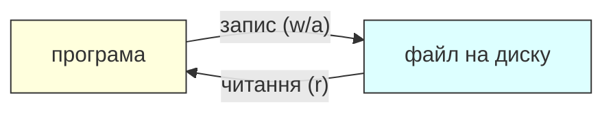

# Урок 13. Файли: Save & Load

**Тривалість:** 45–55 хв  
**XP:** 190

## 🎯 Місія
Навчити програму пам'ятати дані після завершення роботи.

## 💡 Пояснення простою мовою
Файл — це **блокнот** або **щоденник**, який програма пише на диск і може прочитати знову. Коли програма зупиняється, змінні зникають. Але якщо записати ім'я та рівень у файл, при наступному запуску програма зможе їх прочитати. Диск зберігає інформацію навіть коли комп'ютер вимкнений — саме тому файли такі корисні для збереження гри.



> 💡 Режими роботи з файлами: **`"w"`** — запис (перезаписує файл!), **`"a"`** — додавання (дописує в кінець), **`"r"`** — читання.

## ✍️ Запис
```python
with open("save.txt", "w", encoding="utf-8") as file:
    file.write("Marko")
```

## 📖 Читання
```python
with open("save.txt", "r", encoding="utf-8") as file:
    name = file.read()
print(name)
```

## ➕ Додавання
```python
with open("log.txt", "a", encoding="utf-8") as file:
    file.write("Dragon defeated!\n")
```

## 🎮 Просте збереження
```python
name = "Marko"
level = 5

with open("save.txt", "w", encoding="utf-8") as file:
    file.write(f"{name}\n")
    file.write(f"{level}\n")
```

Читання:
```python
with open("save.txt", "r", encoding="utf-8") as file:
    name = file.readline().strip()
    level = int(file.readline())
```

## 🧩 Розбираємо по рядках
```python
with open("save.txt", "w", encoding="utf-8") as file:  # Відкриваємо файл для ЗАПИСУ
    file.write(f"{name}\n")    # Записуємо ім'я + перехід на новий рядок
    file.write(f"{level}\n")   # Записуємо рівень + перехід на новий рядок
# `with` автоматично закриває файл після блоку

with open("save.txt", "r", encoding="utf-8") as file:  # Відкриваємо для ЧИТАННЯ
    name = file.readline().strip()      # Читаємо перший рядок, прибираємо \n
    level = int(file.readline())        # Читаємо другий рядок, перетворюємо на число
```

> 💡 `.strip()` прибирає пробіли та перехід рядка `\n` з початку і кінця. Без нього `name` може бути `"Marko\n"`, що виглядатиме дивно при виведенні.

Додатковий приклад — прочитати весь файл одним рядком:
```python
with open("save.txt", "r", encoding="utf-8") as file:
    lines = file.readlines()   # Повертає список: ["Marko\n", "5\n"]
print(lines[0].strip())        # Marko
```

## ✏️ Вправи
1. Запиши ім'я у файл.
2. Прочитай його.
3. Запиши 5 назв ігор — кожну з нового рядка.
4. Прочитай файл циклом.

## ⭐ Challenge — Game Save
Збережи `name`, `hp`, `level`, `coins`, закрий програму й прочитай їх після нового запуску.

## 🐞 Debug Challenge
Що станеться при:
```python
with open("missing.txt", "r") as file:
    print(file.read())
```
якщо файлу немає?

## ✅ Готовий далі, якщо
Марко розуміє `"r"`, `"w"`, `"a"` і сам робить простий save/load.

## 🏠 Домашня місія
Додай збереження до героя з уроку 11.

## ⚡ Перевір себе
- Що станеться, якщо відкрити файл з `"w"` двічі?
- Чим `readline()` відрізняється від `read()`?
- Який режим відкриває файл для дописування в кінець?
- Що станеться, якщо файлу немає, а ти відкриваєш його з `"r"`?
