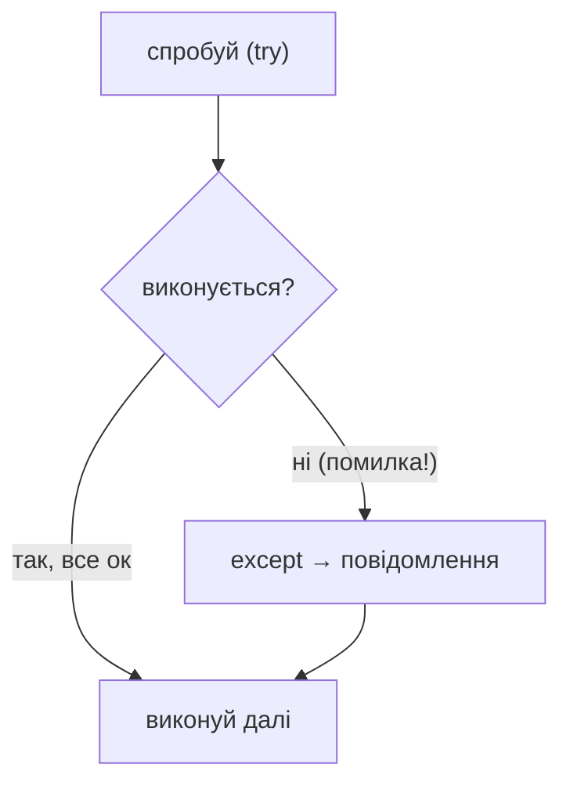

# Урок 14. Помилки та `try/except`

**Тривалість:** 40–50 хв  
**XP:** 190

## 🎯 Місія
Навчитися читати помилки та не дозволяти програмі падати через неправильні дані.

## 💡 Пояснення простою мовою
`try/except` — це як **захисний шолом** або **подушка безпеки** для програми. Ти кажеш: «Спробуй зробити це (try), але якщо станеться помилка — я тебе зловлю (except) і скажу, що пішло не так». Програма НЕ падає, а показує приємне повідомлення. Це як страховка: краще мати її і не мати потреби, ніж мати потребу і не мати її.



## 🧠 Помилка — це підказка
```python
number = int("dragon")
```
Отримаємо `ValueError`.

## 🛡 `try/except`
```python
try:
    age = int(input("Age: "))
    print(age)
except ValueError:
    print("Потрібно ввести число!")
```

## 🔁 Просимо до правильної відповіді
```python
while True:
    try:
        number = int(input("Введи число: "))
        break
    except ValueError:
        print("Це не число!")
```

## 📁 Неіснуючий файл
```python
try:
    with open("save.txt", "r") as file:
        data = file.read()
except FileNotFoundError:
    print("Збереження ще немає.")
```

## 🧩 Розбираємо по рядках
```python
try:                                # Пробуємо виконати блок коду
    age = int(input("Age: "))      # Запитуємо вік і перетворюємо на число
    print(age)                     # Якщо все добре — друкуємо
except ValueError:                 # Якщо сталася помилка типу ValueError
    print("Потрібно ввести число!") # Показуємо дружнє повідомлення
```

```python
try:
    with open("save.txt", "r") as file:  # Пробуємо відкрити файл
        data = file.read()               # Читаємо вміст
except FileNotFoundError:               # Якщо файлу не існує
    print("Збереження ще немає.")        # Повідомляємо про це
```

```python
while True:                         # Безкінечний цикл
    try:
        number = int(input("Введи число: "))  # Пробуємо отримати число
        break                       # Якщо успішно — виходимо з циклу
    except ValueError:              # Якщо не число
        print("Це не число!")       # Повідомляємо і цикл повторюється
```

## ✏️ Вправи
1. Безпечно запитай вік.
2. Безпечно запитай два числа.
3. Оброби відсутній файл.
4. Зроби input, який повторюється після неправильного вводу.

## ⭐ Challenge — Safe Calculator
Калькулятор має пережити неправильний input і ділення на нуль.

Знайди, яку помилку викликає:
```python
100 / 0
```
і оброби її.

## 🐞 Debug Challenge
Які помилки можливі тут?
```python
number = int(input("Number: "))
result = 100 / number
```

## ✅ Готовий далі, якщо
Марко читає останній рядок traceback та використовує `ValueError` і `FileNotFoundError`.

## 🏠 Домашня місія
Зроби save/load таким, щоб відсутність save-файлу не ламала програму.

## ⚡ Перевір себе
- Яка помилка виникає при `int("dragon")`?
- Чому `except ValueError` краще за просто `except`?
- Що станеться, якщо у блоці `try` немає помилки — чи виконається `except`?
- Як змусити користувача вводити число доти, поки не введе правильно?
