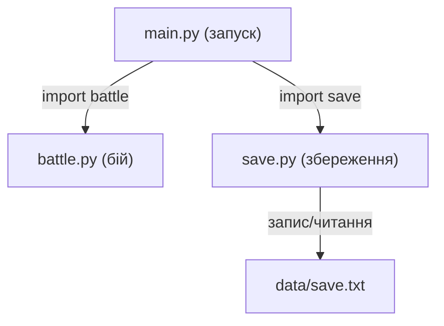

# Урок 15. Власні модулі та структура проєкту

**Тривалість:** 45–55 хв  
**XP:** 210

## 🎯 Місія
Навчитися ділити програму на кілька `.py` файлів.

## 💡 Пояснення простою мовою
Модуль — це як **ящик з інструментами**. Замість того, щоб тримати всі інструменти на столі (в одному файлі), ти складаєш кожен вид окремо: молоток у ящик «battle», викрутку у ящик «save». Коли потрібен молоток — дістаєш ящик `battle`. Так само в програмі: файл `battle.py` містить функції для бою, `save.py` — для збереження. Це допомагає не заплутатися, коли гра стає великою.



## 🧠 Власний модуль
`battle.py`:
```python
import random

def attack():
    return random.randint(5, 20)
```

`main.py`:
```python
import battle

print(battle.attack())
```

Або:
```python
from battle import attack
print(attack())
```

## 🧩 Розбираємо по рядках
```python
import battle                     # Імпортуємо модуль battle.py
print(battle.attack())            # Викликаємо функцію через ім'я модуля
```
Або більш коротко:
```python
from battle import attack         # Імпортуємо ТІЛЬКИ функцію attack
print(attack())                   # Можна викликати напряму, без battle.
```

> 💡 Перший спосіб (`import battle`) — корисний, коли модуль великий і є багато функцій. Другий (`from ... import ...`) — зручний, коли потрібна одна функція і не хочеш постійно писати `battle.` перед кожним викликом.

## 🗂 Структура
```text
my_game/
├── main.py
├── battle.py
├── save.py
└── data/
    └── save.txt
```

## ✏️ Вправи
1. Створи `math_tools.py` з `double(number)`.
2. Створи `dice.py` з `roll_dice()`.
3. Перенеси функцію атаки старої гри в `battle.py`.

## 🐉 Boss — Mini RPG Structure
Створи:
```text
mini_rpg/
├── main.py
├── battle.py
└── save.py
```
`battle.py` відповідає за бій, `save.py` — за збереження, `main.py` — за запуск.

## ✅ Готовий далі, якщо
Марко може створити власний модуль, імпортувати його й пояснити, навіщо розділяти програму.

## 🔮 Далі
Наступна місія — графічні програми з **Pygame**.

## 🏠 Домашня місія
Перетвори одну стару консольну гру на проєкт із кількох файлів.

## ⚡ Перевір себе
- Чим `import battle` відрізняється від `from battle import attack`?
- Якщо у `battle.py` є функція `def attack()`, як її викликати з `main.py` через `import battle`?
- Навіщо розділяти програму на файли, якщо можна написати все в одному?
- Що станеться, якщо викликати `attack()` без імпорту?
