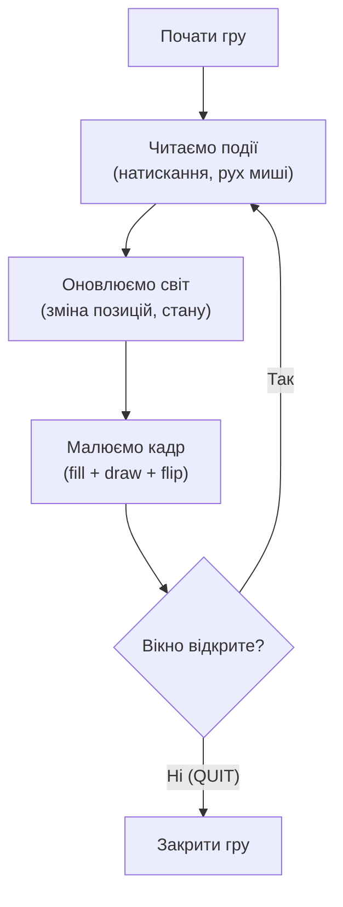

# Урок 16. Pygame: перше графічне вікно

**Тривалість:** 45–60 хв  
**XP:** 230

> Марко, до цього ми працювали тільки з текстом у терміналі. Сьогодні ми вперше побачимо, як програма **малює на екрані**! Це великий крок — ти створюєш не просто лічильник, а справжнє вікно, в якому житимуть ігри.

## 🎯 Місія
Створити графічне вікно й зрозуміти **game loop** — серце будь-якої гри.

Після уроку Марко має вміти:
- встановити Pygame і перевірити версію;
- створити графічне вікно;
- пояснити, що таке game loop і чому гра без нього «замерзає»;
- малювати на екрані прості фігури;
- контролювати швидкість гри через FPS.

## 📦 Крок 1. Встановлення та перевірка

Спочатку ми встановлюємо бібліотеку Pygame. Бібліотека — це готовий набір коду, який написав хтось інший, щоб ми не змальовували вікно «з нуля».

```bash
pip install pygame
```

Перевір, чи все вийшло:

```python
import pygame
print(pygame.version.ver)
```

> **✅ Перевір себе:** на екрані з'явився номер версії (наприклад `2.6.1`)? Якщо ні — повтори крок установки. Якщо бачиш помилку `ModuleNotFoundError` — значить, `pip install` не завершився так, як треба.

## 🪟 Крок 2. Створюємо вікно

Уявімо, що екран — це полотно художника. Щоб почати малювати, треба спершу розкласти полотно.

```python
import pygame

pygame.init()
screen = pygame.display.set_mode((800, 600))
pygame.display.set_caption("Marko's Game")
```

Розберемо кожен рядок:
- `pygame.init()` — «розбудити» Pygame і підготувати все, що йому потрібно;
- `set_mode((800, 600))` — створити полотно розміром 800 на 600 пікселів (ширина × висота);
- `set_caption(...)` — написати назву у вікні.

> **💡 Аналогія:** `set_mode` — це як сказати «дай мені аркуш паперу 800 на 600 клітинок». Піксель — одна така клітинка.

## 🔁 Крок 3. Game loop — серце гри

Якщо запустити програму прямо зараз, вікно зникне через мілісекунду, бо код закінчився. Щоб вікно **жило й працювало**, треба тримати програму в циклі. Це і є **game loop**.

```python
running = True

while running:
    for event in pygame.event.get():
        if event.type == pygame.QUIT:
            running = False

pygame.quit()
```

`pygame.QUIT` — це подія «користувач натиснув хрестик закриття вікна». Тоді `running` стає `False`, цикл завершується, а `pygame.quit()` коректно закриває гру.

Чому цикл потрібен — показано на діаграмі:



> **💡 Аналогія:** уявімо мультфільм. Він складається з багатьох малюнків (кадрів), які швидко змінюються. Game loop — це «прокручування» кадрів знову і знову.

## 🎨 Крок 4. Малювання на екрані

Зараз екран чорний. Намалюймо першу фігуру! Цей код ставимо **всередину** циклу:

```python
screen.fill((30, 30, 30))                # 1. залити весь екран кольором
pygame.draw.rect(screen, (50, 150, 255), (100, 100, 80, 80))  # 2. намалювати прямокутник
pygame.display.flip()                    # 3. показати кадр
```

Що означає кожна частина:
- `screen.fill((30, 30, 30))` — залити фон темно-сірим. Перші два числа — це колір у форматі RGB (червоний, зелений, синій);
- `pygame.draw.rect(...)` — намалювати прямокутник на `screen`;
- `pygame.display.flip()` — **показати** все, що намалювали. Без цього кадр залишиться «в буфері» і ти не побачиш результат.

Колір задається трійкою **(R, G, B)**. Кожне число — від 0 до 255. Кілька прикладів:

| Колір | Код |
|---|---|
| Чорний | `(0, 0, 0)` |
| Білий | `(255, 255, 255)` |
| Червоний | `(255, 0, 0)` |
| Зелений | `(0, 255, 0)` |
| Синій | `(0, 0, 255)` |
| Жовтий | `(255, 255, 0)` |

> **🔬 Експеримент:** зміни числа в `fill` і подивись, як змінюється колір фону. Спробуй `(200, 200, 0)` — стане жовтуватий.

## ⏱ Крок 5. FPS — швидкість гри

Без контролю швидкості гра крутитиметься так швидко, як дозволить комп'ютер (навіть тисячі кадрів за секунду!). Щоб цього уникнути, використовуємо `Clock`.

**Перед циклом** створимо годинник:

```python
clock = pygame.time.Clock()
```

**Наприкінці циклу** зупинимося на 60 кадрах за секунду:

```python
clock.tick(60)
```

`tick(60)` каже Pygame: «зроби паузу так, щоб за секунду вийшло не більше 60 кадрів». Це робить гру плавною і однаковою на різних комп'ютерах.

## 🧩 Повна програма разом

Ось ціла перша гра. Пробуй запустити й змінювати:

```python
import pygame

pygame.init()
screen = pygame.display.set_mode((800, 600))
pygame.display.set_caption("Marko's Game")
clock = pygame.time.Clock()

running = True
while running:
    for event in pygame.event.get():
        if event.type == pygame.QUIT:
            running = False

    screen.fill((30, 30, 30))
    pygame.draw.rect(screen, (50, 150, 255), (100, 100, 80, 80))
    pygame.display.flip()
    clock.tick(60)

pygame.quit()
```

## ✏️ Вправи (по черзі)

1. Вікно 800×600.
2. Власний заголовок (наприклад `"Marko's Adventure"`).
3. Інший фон — обери свій колір.
4. Прямокутник іншого розміру й кольору.
5. Коло через `pygame.draw.circle()`. Підказка: складається з `(screen, color, (x, y), radius)`.

### Після кожної вправи
> **✅ Зупинись і перевір:** програма запускається без помилок? Малює саме те, що ти задумав? Якщо так — переходь до наступної вправи.

## ⭐ Challenge — Robot
Намалюй робота лише прямокутниками, колами й лініями: голова, тіло, руки, ноги, очі.

## 🐞 Debug Challenge
Що станеться, якщо після малювання **забути** `pygame.display.flip()`?

*Підказка: подумай, чи «перекинеться» намальоване на справжній екран.*

## ✅ Готовий далі, якщо
Марко може:
- пояснити своїми словами, що таке game loop;
- пояснити, навіщо потрібен `pygame.display.flip()`;
- пояснити, для чого `clock.tick(60)`;
- намалювати прямокутник, коло й лінію;
- самостійно змінити колір, розмір і позицію фігур.

## 🏠 Домашня місія
Намалюй сцену: небо, земля, герой і сонце. Не забудь контролювати FPS і коректно завершувати програму.
