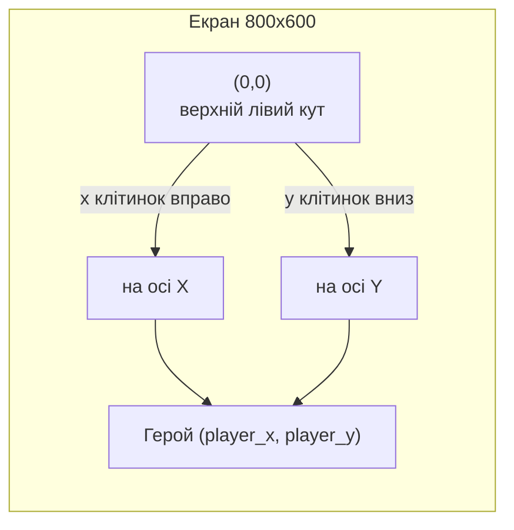
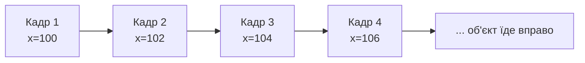

# Урок 17. Pygame: координати та рух

**Тривалість:** 45–60 хв  
**XP:** 240

> Марко, у минулому уроці ми навчилися малювати нерухомі фігури. Сьогодні оживимо їх! Рух — це просто **поступова зміна координат** з кожним кадром.

## 🎯 Місія
Змусити об'єкти рухатися.

Після уроку Марко має вміти:
- розуміти систему координат Pygame;
- змінювати позицію об'єкта з кожним кадром;
- перевіряти межі екрана;
- змусити об'єкт «відбиватися» від стін.

## 🗺 Крок 1. Розуміємо координати

На відміну від математики, у Pygame вісь `y` росте **вниз**, а не вгору. Точка `(0, 0)` — у верхньому лівому куті екрана.

```text
(0, 0) ─────────→ X  (вправо)
  |
  |
  ↓
  Y  (вниз)
```

Це важливо:
- `x` — наскільки **вправо**;
- `y` — наскільки **вниз**.

> **💡 Аналогія:** уяви екран як аркуш зошита в клітинку, але повернутий так, щоб початок був зверху-зліва. `x` — кількість клітинок направо, `y` — кількість клітинок униз.



## 🚀 Крок 2. Зберігаємо позицію у змінних

Щоб рухати об'єкт, зберігайо координати у змінних. Так їх можна змінювати.

```python
player_x = 100
player_y = 300
```

## 🏃 Крок 3. Рух — це зміна координат

У game loop **щоразу, коли малюємо кадр**, збільшуємо `player_x` на 2. Це зрушує об'єкт праворуч.

```python
player_x += 2

pygame.draw.rect(
    screen,
    (0, 200, 100),
    (player_x, player_y, 50, 50)
)
```

> **🔑 Головна ідея:** на кожному кадрі об'єкт малюється на 2 пікселі правіше. Коли кадри швидко змінюються, око бачить плавний рух.



## 🧱 Крок 4. Перевірка меж — щоб не вилетіти з екрана

Якщо нічого не робити, квадрат поїде за правий край і зникне. Щоб він зупинявся, перевір координату:

```python
if player_x > 750:
    player_x = 750
```

Чому `750`, а не `800`? Бо сам квадрат завширшки 50 пікселів. `800 - 50 = 750` — це крайня позиція, де правий бік квадрата ще на екрані.

> **✅ Перевір себе:** поясни вголос, чому межа для об'єкта розміром 50 на полотні 800 — це 750, а не 800.

## 🧩 Повна програма (квадрат їде вправо)

```python
import pygame

pygame.init()
screen = pygame.display.set_mode((800, 600))
clock = pygame.time.Clock()

player_x = 100
player_y = 300

running = True
while running:
    for event in pygame.event.get():
        if event.type == pygame.QUIT:
            running = False

    player_x += 2
    if player_x > 750:
        player_x = 750

    screen.fill((30, 30, 30))
    pygame.draw.rect(screen, (0, 200, 100), (player_x, player_y, 50, 50))
    pygame.display.flip()
    clock.tick(60)

pygame.quit()
```

## ✏️ Вправи (по черзі)

1. Квадрат їде вправо.
2. Після правого краю з'являється зліва (*підказка: коли `player_x > 800`, поверни `player_x = 0`*).
3. Коло падає вниз (*його малює `pygame.draw.circle`; координата `y` має збільшуватися*).
4. Два об'єкти рухаються з різними швидкостями (*наприклад, один на `+2`, інший на `+5`*).

### Після кожної вправи
> **✅ Зупинись і перевір:** об'єкт рухається в потрібному напрямку і з правильною швидкістю? Якщо так — переходь далі.

## ⭐ Challenge — Bouncing Ball

Змусити м'яч відбиватися від стіни. Тримаємо напрямок у змінній `speed`. Коли м'яч торкається краю — **розвертаємо** напрямок:

```python
speed = 4

while running:
    # ...
    player_x += speed

    if player_x > 750:
        speed = -speed   # тепер летить уліво
    if player_x < 0:
        speed = -speed   # тепер летить управо
```

## ⭐⭐ Mega Challenge
Відбивай м'яч від усіх **чотирьох** стін. Для цього тримай окремо горизонтальну й вертикальну швидкості:

```python
speed_x = 4
speed_y = 3
```

Питання для роздумів: чому зручно мати дві окремі швидкості, а не одну?

## 🐞 Debug Challenge
```python
x = 100
while running:
    pygame.draw.rect(screen, (255, 0, 0), (x, 100, 50, 50))
```

Чому квадрат **не рухається**?

*Підказка: шукай, чи змінюється хоч якась змінна всередині циклу.*

## ✅ Готовий далі, якщо
Марко може:
- пояснити, у якому напрямку росте `y` у Pygame;
- пояснити, чому для руху треба змінювати координату кожен кадр;
- перевірити межу, щоб об'єкт не зникав за краєм;
- пояснити, як працює `speed = -speed` для відбивання.

## 🏠 Домашня місія
Зроби screensaver із трьома рухомими фігурами, які відбиваються від стін.
