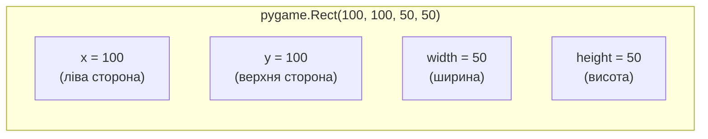
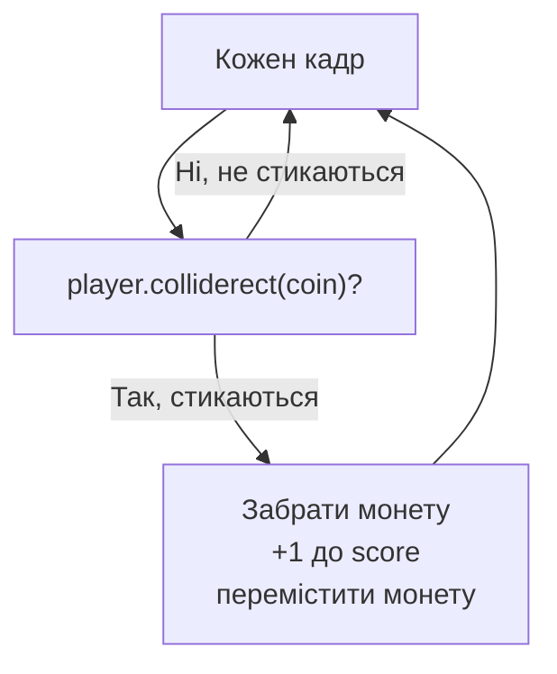

# Урок 19. Pygame: `Rect`, картинки та collision

**Тривалість:** 50–65 хв  
**XP:** 280

> Марко, тепер справжня магія гри — **взаємодія об'єктів**! Герой зачепив монетку → монетка зникає. Герой зачепив ворога → гра скінчилася. Це називається **collision** (зіткнення), і сьогодні ми його навчимося.

## 🎯 Місія
Навчити ігрові об'єкти взаємодіяти.

Після уроку Марко має вміти:
- користуватися `pygame.Rect`;
- виявляти зіткнення через `colliderect`;
- переміщувати об'єкти на випадкову позицію;
- завантажувати й масштабувати картинку;
- рахувати `score`.

## 🧱 Крок 1. Що таке `Rect`

До цього ми передавали координати як чотири числа: `(x, y, ширина, висота)`. Pygame уміє об'єднувати їх в об'єкт **`Rect`** (прямокутник), у якого є властивості `x`, `y`, і методи на кшталт перевірки зіткнення.

```python
player = pygame.Rect(100, 100, 50, 50)
pygame.draw.rect(screen, (0, 200, 100), player)

player.x += 5
player.y -= 5
```

`Rect` — це як «паспорт» прямокутника: він знає, де він (`x`, `y`) і який він (`width`, `height`). Рухати так само зручно — змінюємо `player.x`.

> **💡 Аналогія:** `Rect` — це етикетка з розмірами на коробці. Поки коробка має таку етикетку, можна легко сказати, чи дві коробки стикаються.



## 💥 Крок 2. Collision — виявлення зіткнення

Створимо монету як `Rect` у певній позиції. Щоб перевірити, чи торкається гравець монети, використовуємо метод `colliderect`:

```python
coin = pygame.Rect(400, 300, 30, 30)

if player.colliderect(coin):
    print("Coin collected!")
```

`player.colliderect(coin)` — це питання: «чи перетинаються ці два прямокутники?». Повертає `True` або `False`.



> **✅ Перевір себе:** поясни вголос, у який момент треба перевіряти зіткнення — до чи після малювання? Чи це взагалі важливо?

## 🪙 Крок 3. Нове місце монети

Коли монету зібрали, хочемо з'явити нову в іншому місці. Підключаємо `random` і задаємо випадкові координати:

```python
import random

coin.x = random.randint(0, 770)
coin.y = random.randint(0, 570)
```

Чому `770`, а не `800`? Тому що монета завширшки 30 пікселів, і її правий край не має вилітати за екран: `800 - 30 = 770`. Так само по висоті: `600 - 30 = 570`.

## 🖼 Крок 4. Картинка замість прямокутника

Герой-квадрат — це нудно. Підставимо справжню картинку. Поклади файл `player.png` поруч зі скриптом:

```python
player_image = pygame.image.load("player.png").convert_alpha()
player_image = pygame.transform.scale(player_image, (50, 50))
screen.blit(player_image, player)
```

Що відбувається:
1. `pygame.image.load(...)` — завантажуємо файл картинки;
2. `.convert_alpha()` — готуємо її для швидкого малювання (і з прозорим фоном);
3. `pygame.transform.scale(..., (50, 50))` — змінюємо розмір до 50×50;
4. `screen.blit(player_image, player)` — «приклеюємо» картинку на екран у позиції `Rect`.

> **💡 Аналогія:** `blit` — це як наліпка-наклейка. Ти береш картинку і приклеюєш її на полотно в потрібне місце.

## 🧩 Повна програма (збираємо монети)

```python
import pygame
import random

pygame.init()
screen = pygame.display.set_mode((800, 600))
clock = pygame.time.Clock()

player = pygame.Rect(400, 300, 50, 50)
coin = pygame.Rect(400, 100, 30, 30)
score = 0

running = True
while running:
    for event in pygame.event.get():
        if event.type == pygame.QUIT:
            running = False

    keys = pygame.key.get_pressed()
    if keys[pygame.K_LEFT]:
        player.x -= 5
    if keys[pygame.K_RIGHT]:
        player.x += 5
    if keys[pygame.K_UP]:
        player.y -= 5
    if keys[pygame.K_DOWN]:
        player.y += 5

    if player.colliderect(coin):
        score += 1
        print("Score:", score)
        coin.x = random.randint(0, 770)
        coin.y = random.randint(0, 570)

    screen.fill((30, 30, 30))
    pygame.draw.rect(screen, (0, 200, 100), player)
    pygame.draw.rect(screen, (255, 215, 0), coin)
    pygame.display.flip()
    clock.tick(60)

pygame.quit()
```

## ✏️ Вправи (по черзі)

1. Перероби player на `Rect`.
2. Створи coin як `Rect`.
3. Рухай player (клавіатурою — з уроку 18).
4. При collision переміщуй coin.
5. Додай `score` і виводь його через `print`.

### Після кожної вправи
> **✅ Зупинись і перевір:** чи все працює так, як очікував? Чи не зникла жодна можливість із минулих уроків (межі, керування)?

## ⭐ Challenge — Enemy

Створи червоного ворога як ще один `Rect`. При collision з ним — `GAME OVER` (заверши гру через `running = False` або виведи повідомлення).

## ⭐⭐ Challenge — Multiple Coins

Замість однієї монети зроби список із кількох `pygame.Rect` і перевіряй кожну циклом `for`.

## 🐞 Debug Challenge

Чому score може збільшуватися **багато разів**, якщо після collision монета залишається на місці?

*Підказка: скільки кадрів гравець «стикається» з монетою, доки вони перетинаються?*

## ✅ Готовий далі, якщо
Марко може:
- пояснити, що таке `Rect` і навіщо він потрібен;
- пояснити, що робить `colliderect`;
- завантажити й масштабувати картинку, використати `blit`;
- пояснити, чому монету треба переміщувати одразу після зіткнення.

## 🏠 Домашня місія
Зроби сцену з героєм, трьома монетами та ворогом. За кожну монету +1 очко, при контакті з ворогом — «GAME OVER».
