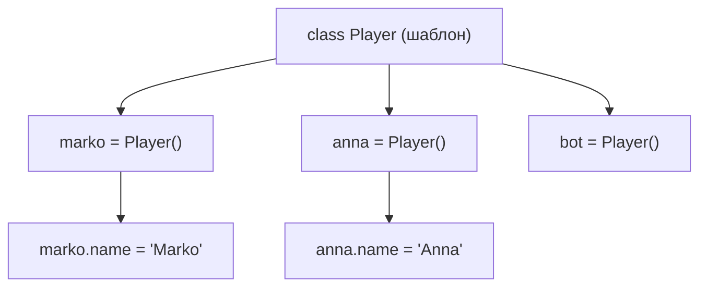

# Урок 21. OOP — класи та об'єкти

**Тривалість:** 45–60 хв  
**Рівень:** OOP Explorer

## 🎯 Місія
Створи перший клас `Player` і кілька незалежних об'єктів.

## 🧠 Ключова ідея
```python
class Player:
    pass

marko = Player()
marko.name = "Marko"
marko.hp = 100
```

## 💡 Пояснення простою мовою
Клас — це **креслення** (шаблон), за яким створюються об'єкти. Один клас `Player` може породити скільки завгодно різних гравців — як форма для печива: тісто одне, а печива можна наліпити скільки завгодно. Кожен об'єкт — це окрема «іграшка», яка живе своїм життям.

## 🧩 Розбираємо по рядках
```python
class Player:       # «Створюю шаблон з ім'ям Player»
    pass            # Поки порожньо — тільки оголошуємо клас

marko = Player()    # Роблю перший об'єкт з шаблону Player
marko.name = "Marko"# Додаю об'єкту властивість name
marko.hp = 100      # Додаю властивість hp (здоров'я)
```

## 🔎 Приклад: запускай і дивись
```python
class Monster:
    pass

goblin = Monster()
goblin.name = "Goblin"
goblin.hp = 30

dragon = Monster()
dragon.name = "Dragon"
dragon.hp = 200

print(goblin.name, "має", goblin.hp, "HP")
print(dragon.name, "має", dragon.hp, "HP")

goblin.hp = 0
print(goblin.name, "має", goblin.hp, "HP")
print(dragon.name, "має", dragon.hp, "HP")  # Dragon не змінився!
```
Тут бачимо: `goblin` і `dragon` — це два різних об'єкти. Змінивши одного, ми НЕ чіпаємо іншого.



## ✏️ Основні завдання
1. Створи `Monster`.
   🙋 *Підказка:* Пороби як `Player` з `pass`.
2. Створи 3 монстрів.
   🙋 *Підказка:* Зроби три рядки `m1 = Monster()`, `m2 = Monster()`, `m3 = Monster()`.
3. Дай кожному `name`, `hp`, `damage`.
   🙋 *Підказка:* Після кожного створення додай `m1.name = ...` тощо.
4. Зміни лише один об'єкт і перевір незалежність інших.
   🙋 *Підказка:* Зміни `hp` одного монстра та `print()` усіх трьох.

## ⭐ Challenge
Створи `Player`, `Monster` і `Treasure`, а потім маленьку сцену з об'єктів.

## 🧪 Перед запуском
Хоча б раз за урок спробуй **передбачити результат коду до запуску**. Після запуску порівняй прогноз із реальністю.

## 🐞 Debug Mission
Навмисно зламай одну частину програми. Прочитай traceback або спостережи неправильну поведінку, знайди причину й виправ її.

## ✅ Урок завершено, якщо Марко може
- пояснити головну ідею своїми словами;
- виконати основні завдання без копіювання готового рішення;
- змінити програму під нову вимогу;
- знайти й виправити хоча б одну власну помилку.

## 🏠 Домашня місія
Покращ Challenge **однією власною ідеєю**. Перед кодом сформулюй її одним реченням.

## 💡 Підказка для дорослого
Не виправляйте код одразу. Краще запитайте: **«Що ти очікував? Що сталося? Який рядок за це відповідає? Що можна перевірити?»**
