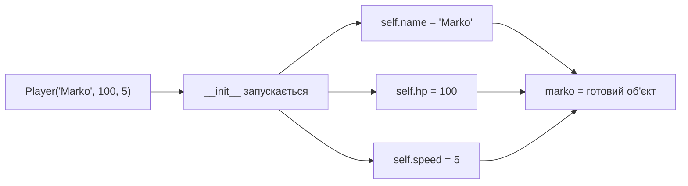

# Урок 22. OOP — __init__, self та атрибути

**Тривалість:** 45–60 хв  
**Рівень:** OOP Explorer

## 🎯 Місія
Навчи клас одразу створювати правильно налаштовані об'єкти.

## 🧠 Ключова ідея
```python
class Player:
    def __init__(self, name, hp, speed):
        self.name = name
        self.hp = hp
        self.speed = speed

marko = Player("Marko", 100, 5)
```

## 💡 Пояснення простою мовою
`__init__` — це **конструктор**, який автоматично запускається, коли ти створюєш об'єкт. Він одразу заповнює всі потрібні поля, замість того щоб додавати їх вручну. `self` — це посилання на сам об'єкт, що саме створюється (типовий «я»).

## 🧩 Розбираємо по рядках
```python
class Player:
    def __init__(self, name, hp, speed):  # Конструктор: приймає параметри
        self.name = name   # self.name = «ім'я цього конкретного об'єкта»
        self.hp = hp       # Здоров'я записуємо всередину
        self.speed = speed # Швидкість теж

marko = Player("Marko", 100, 5)
# Python викликає __init__(marko, "Marko", 100, 5)
# Тепер marko.name == "Marko", marko.hp == 100, marko.speed == 5
```



## 🔎 Приклад: запускай і дивись
```python
class Enemy:
    def __init__(self, name, hp, damage):
        self.name = name
        self.hp = hp
        self.damage = damage
        self.alive = True

goblin = Enemy("Goblin", 30, 5)
orc = Enemy("Orc", 80, 12)

print(goblin.name, "— HP:", goblin.hp, "alive:", goblin.alive)
print(orc.name, "— HP:", orc.hp, "alive:", orc.alive)
```

```python
class Enemy:
    def __init__(self, name, hp, damage):
        self.name = name
        self.hp = hp
        self.damage = damage
        self.alive = True

e1 = Enemy("Bat", 10, 3)
e2 = Enemy("Wolf", 25, 7)
e3 = Enemy("Troll", 50, 10)

print(e1.name, e2.name, e3.name)
e1.alive = False
print(e1.name, "alive:", e1.alive)
print(e2.name, "alive:", e2.alive)  # Wolf все ще живий
```

## ✏️ Основні завдання
1. Створи `Enemy(name, hp, damage)`.
   🙋 *Підказка:* Напиши `__init__` з трьома параметрами окрім `self`.
2. Створи 5 ворогів.
   🙋 *Підказка:* П'ять рядків на кшталт `e1 = Enemy(...)`.
3. Додай `alive`.
   🙋 *Підказка:* Додай `self.alive = True` всередині `__init__`.
4. Поясни `self` своїми словами.
   🙋 *Підказка:* Спробуй замінити `self` на ім'я об'єкта — побачиш, що це працює, але кашується в довжину!

## ⭐ Challenge
Створи героя з `name`, `hp`, `damage`, `speed`, `coins`, `level` одним викликом конструктора.

## 🧪 Перед запуском
Хоча б раз за урок спробуй **передбачити результат коду до запуску**. Після запуску порівняй прогноз із реальністю.

## 🐞 Debug Mission
Навмисно зламай одну частину програми. Прочитай traceback або спостережи неправильну поведінку, знайди причину й виправ її.

## ✅ Урок завершено, якщо Марко може
- пояснити головну ідею своїми словами;
- виконати основні завдання без копіювання готового рішення;
- змінити програму під нову вимогу;
- знайти й виправити хоча б одну власну помилку.

## 🏠 Домашня місія
Покращ Challenge **однією власною ідеєю**. Перед кодом сформулюй її одним реченням.

## 💡 Підказка для дорослого
Не виправляйте код одразу. Краще запитайте: **«Що ти очікував? Що сталося? Який рядок за це відповідає? Що можна перевірити?»**
