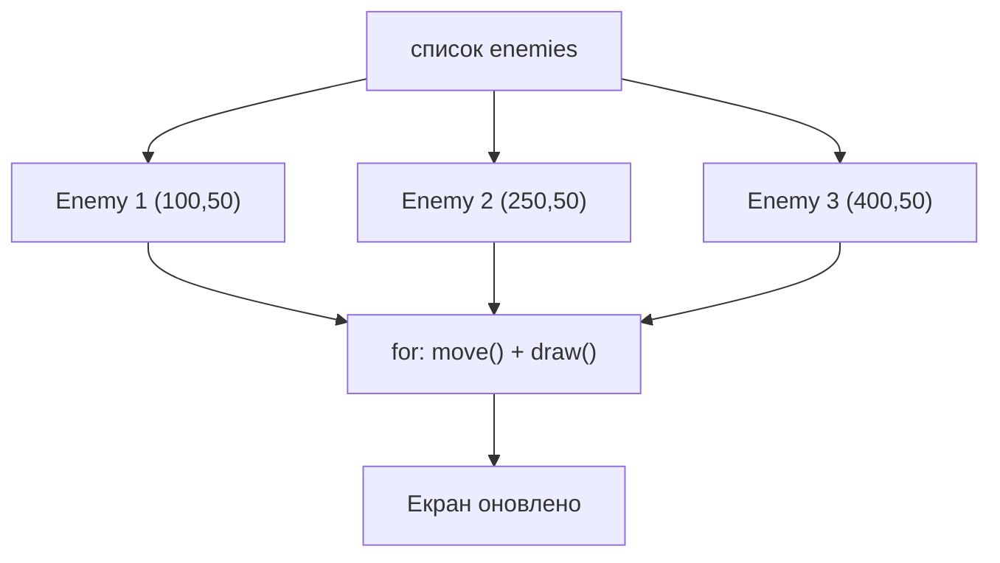

# Урок 25. Списки об'єктів — багато ворогів

**Тривалість:** 45–60 хв  
**Рівень:** OOP Explorer

## 🎯 Місія
Навчися керувати десятками `Enemy` одним циклом.

## 🧠 Ключова ідея
```python
enemies = [Enemy(100, 50), Enemy(250, 50), Enemy(400, 50)]

for enemy in enemies:
    enemy.move()
    enemy.draw(screen)
```

## 💡 Пояснення простою мовою
Замість того щоб створювати змінні `e1`, `e2`, `e3` окремо, ми складаємо всіх ворогів у **список** і проходимо по ньому циклом `for`. Один рядок коду керує ВСІМА ворогами — і 3, і 100.

## 🧩 Розбираємо по рядках
```python
enemies = [Enemy(100, 50), Enemy(250, 50), Enemy(400, 50)]
# Створюємо список з 3 ворогів одразу

for enemy in enemies:       # Для кожного ворога у списку...
    enemy.move()            # ...він рухається
    enemy.draw(screen)      # ...він малюється
```



## 🔎 Приклад: запускай і дивись
```python
class Enemy:
    def __init__(self, x, y):
        self.x = x
        self.y = y
        self.alive = True

    def move(self):
        self.x += 5

    def show(self):
        print(f"  [{self.x}, {self.y}, alive={self.alive}]")

enemies = [Enemy(10, 20), Enemy(50, 20), Enemy(90, 20)]

for e in enemies:
    e.show()

print("--- рухаємо ---")
for e in enemies:
    e.move()

for e in enemies:
    e.show()

enemies[1].alive = False
print("--- видаляємо мертвих ---")
enemies = [e for e in enemies if e.alive]
for e in enemies:
    e.show()  # Лише 2 вороги
```

## ✏️ Основні завдання
1. Створи 10 Enemy.
   🙋 *Підказка:* `enemies = []` + цикл `for i in range(10): enemies.append(Enemy(...))`
2. Дай випадкові координати.
   🙋 *Підказка:* `import random` і `random.randint(0, 700)` для x.
3. Видаляй переможених.
   🙋 *Підказка:* `enemies = [e for e in enemies if e.alive]` — фільтруємо список.
4. Покажи кількість ворогів.
   🙋 *Підказка:* `print(f"Ворогів: {len(enemies)}")`

## ⭐ Challenge
Створи хвилю ворогів, що завершується після знищення всіх.

## 🧪 Перед запуском
Хоча б раз за урок спробуй **передбачити результат коду до запуску**. Після запуску порівняй прогноз із реальністю.

## 🐞 Debug Mission
Навмисно зламай одну частину програми. Прочитай traceback або спостережи неправильну поведінку, знайди причину й виправ її.

## 🌱 Git: перший save point
Якщо Git уже встановлено:
```bash
git init
git add .
git commit -m "My first save point"
```
Поки що достатньо думати про commit як про **save point програміста**.

## ✅ Урок завершено, якщо Марко може
- пояснити головну ідею своїми словами;
- виконати основні завдання без копіювання готового рішення;
- змінити програму під нову вимогу;
- знайти й виправити хоча б одну власну помилку.

## 🏠 Домашня місія
Покращ Challenge **однією власною ідеєю**. Перед кодом сформулюй її одним реченням.

## 💡 Підказка для дорослого
Не виправляйте код одразу. Краще запитайте: **«Що ти очікував? Що сталося? Який рядок за це відповідає? Що можна перевірити?»**
