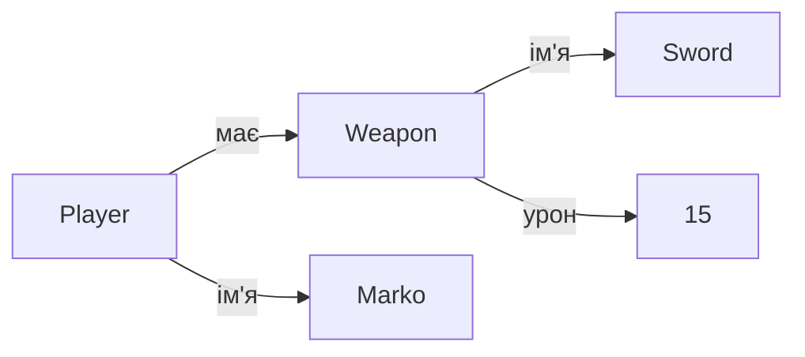

# Урок 26. Composition — Player має Weapon

**Тривалість:** 45–60 хв  
**Рівень:** OOP Explorer

## 🎯 Місія
Зрозумій композицію: герой може мати окремий об'єкт-зброю.

## 🧠 Ключова ідея
```python
class Weapon:
    def __init__(self, name, damage):
        self.name = name
        self.damage = damage

class Player:
    def __init__(self, name, weapon):
        self.name = name
        self.weapon = weapon
```

## 💡 Пояснення простою мовою
**Композиція** (has-a) означає: «Гравець *має* зброю». Зброя — це окремий об'єкт, який живе всередині гравця. Можна змінювати зброю, не переробляючи весь клас Player. Як рюкзак: змінив інструмент — а рюкзак той самий.

## 🧩 Розбираємо по рядках
```python
class Weapon:                               # Окремий клас для зброї
    def __init__(self, name, damage):
        self.name = name
        self.damage = damage

class Player:
    def __init__(self, name, weapon):        # При створенні даємо зброю
        self.name = name
        self.weapon = weapon                # Зберігаємо об'єкт Weapon тут

sword = Weapon("Sword", 15)                # Створюємо зброю
marko = Player("Marko", sword)             # Даємо її гравцю
print(marko.weapon.damage)                 # 15 — дістаємо урон зброї
```



## 🔎 Приклад: запускай і дивись
```python
class Weapon:
    def __init__(self, name, damage):
        self.name = name
        self.damage = damage

class Player:
    def __init__(self, name, weapon):
        self.name = name
        self.weapon = weapon

    def attack(self):
        print(f"{self.name} б'є {self.weapon.name} (урон: {self.weapon.damage})")

sword = Weapon("Меч", 15)
bow = Weapon("Лук", 10)

marko = Player("Marko", sword)
marko.attack()          # Marko б'є Меч (урон: 15)

marko.weapon = bow      # Змінюємо зброю!
marko.attack()          # Marko б'є Лук (урон: 10)
```

## ✏️ Основні завдання
1. Створи Sword, Bow, Laser.
   🙋 *Підказка:* Три рядки `Weapon(...)` з різними назвами та уроном.
2. Дозволь змінювати weapon.
   🙋 *Підказка:* Просто `player.weapon = new_weapon` — Python дозволяє перезаписувати атрибути.
3. Використай `player.weapon.damage`.
   🙋 *Підказка:* Звернися до властивості через крапку: `player.weapon.damage`.
4. Створи inventory зброї.
   🙋 *Підказка:* `inventory = [sword, bow, laser]` — звичайний список об'єктів Weapon.

## ⭐ Challenge
Зроби магазин зброї та зміну активної зброї.

## 🧪 Перед запуском
Хоча б раз за урок спробуй **передбачити результат коду до запуску**. Після запуску порівняй прогноз із реальністю.

## 🐞 Debug Mission
Навмисно зламай одну частину програми. Прочитай traceback або спостережи неправильну поведінку, знайди причину й виправ її.

## ✅ Урок завершено, якщо Марко може
- пояснити головну ідею своїми словами;
- виконати основні завдання без копіювання готового рішення;
- змінити програму під нову вимогу;
- знайти й виправити хоча б одну власну помилку.

## 🏠 Домашня місія
Покращ Challenge **однією власною ідеєю**. Перед кодом сформулюй її одним реченням.

## 💡 Підказка для дорослого
Не виправляйте код одразу. Краще запитайте: **«Що ти очікував? Що сталося? Який рядок за це відповідає? Що можна перевірити?»**
