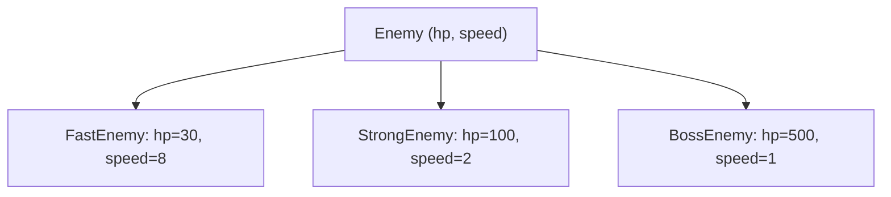

# Урок 27. Наслідування

**Тривалість:** 45–60 хв  
**Рівень:** OOP Explorer

> **📖 Словник:** *наслідування* (англ. *"inheritance"*) — коли новий клас «успадковує» (копіює) все з батьківського класу й може додати своє. Ключова ідея «is-a» (є/це різновид).

## 🎯 Місія
Створи спеціальні типи ворогів на основі спільного `Enemy`.

## 🧠 Ключова ідея
```python
class Enemy:
    def __init__(self, hp, speed):
        self.hp = hp
        self.speed = speed

class FastEnemy(Enemy):
    def __init__(self):
        super().__init__(30, 8)
```

## 💡 Пояснення простою мовою
**Наслідування** (is-a) дозволяє створити новий клас, який *копіює* все з батьківського та додає своє. `FastEnemy` — це `Enemy`, тільки швидший. Не потрібно переписувати весь код — `super().__init__()` викликає батьківський конструктор.

## 🧩 Розбираємо по рядках
```python
class Enemy:
    def __init__(self, hp, speed):
        self.hp = hp
        self.speed = speed

class FastEnemy(Enemy):           # FastEnemy НАСЛІДУЄ Enemy
    def __init__(self):
        super().__init__(30, 8)   # super() = батьківський клас Enemy
        # Тобто FastEnemy(30, 8), але без аргументів при створенні
```



## 🔎 Приклад: запускай і дивись
```python
class Enemy:
    def __init__(self, hp, speed):
        self.hp = hp
        self.speed = speed

    def info(self):
        print(f"HP: {self.hp}, Speed: {self.speed}")

class FastEnemy(Enemy):
    def __init__(self):
        super().__init__(30, 8)

class StrongEnemy(Enemy):
    def __init__(self):
        super().__init__(100, 2)

e1 = FastEnemy()
e2 = StrongEnemy()
e1.info()    # HP: 30, Speed: 8
e2.info()    # HP: 100, Speed: 2
```

## ✏️ Основні завдання
1. Створи `StrongEnemy`.
   🙋 *Підказка:* `class StrongEnemy(Enemy)` + `super().__init__(100, 2)` з іншими значеннями.
2. Створи `BossEnemy`.
   🙋 *Підказка:* Дуже багато HP, мало швидкості, наприклад `(500, 1)`.
3. Дай різні HP/speed.
   🙋 *Підказка:* Пограй з цифрами — Fast = мало HP / велика speed, Strong = навпаки.
4. Згенеруй випадкові типи.
   🙋 *Підказка:* `import random` + `random.choice([FastEnemy(), StrongEnemy(), BossEnemy()])`.

## ⭐ Challenge
Випадково генеруй 3 типи ворогів у Pygame.

## 🧪 Перед запуском
Хоча б раз за урок спробуй **передбачити результат коду до запуску**. Після запуску порівняй прогноз із реальністю.

## 🐞 Debug Mission
Навмисно зламай одну частину програми. Прочитай traceback або спостережи неправильну поведінку, знайди причину й виправ її.

## ✅ Урок завершено, якщо Марко може
- пояснити головну ідею своїми словами;
- виконати основні завдання без копіювання готового рішення;
- змінити програму під нову вимогу;
- знайти й виправити хоча б одну власну помилку.

## 🏠 Домашня місія
Покращ Challenge **однією власною ідеєю**. Перед кодом сформулюй її одним реченням.

## 💡 Підказка для дорослого
Не виправляйте код одразу. Краще запитайте: **«Що ти очікував? Що сталося? Який рядок за це відповідає? Що можна перевірити?»**
