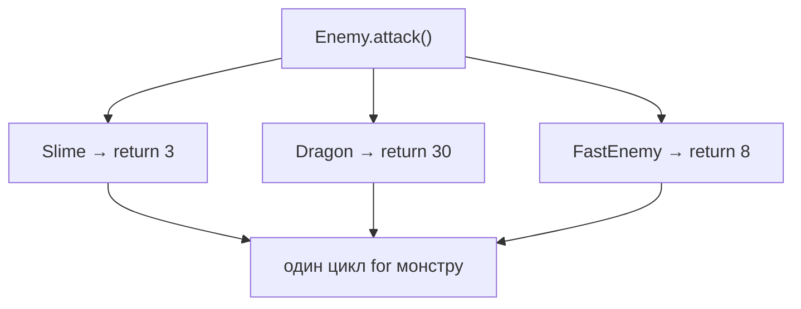

# Урок 28. Різна поведінка об'єктів

**Тривалість:** 45–60 хв  
**Рівень:** OOP Explorer

> **📖 Словник:** *поліморфізм* (англ. *"polymorphism"*, з грец. «багато форм») — коли однаковий виклик методу дає різний результат залежно від типу об'єкта.

## 🎯 Місія
Навчи різні об'єкти по-різному виконувати однакові команди.

## 🧠 Ключова ідея
```python
class Slime(Enemy):
    def attack(self):
        return 3

class Dragon(Enemy):
    def attack(self):
        return 30
```

## 💡 Пояснення простою мовою
Це **поліморфізм** («багато форм»): однаковий виклик `enemy.attack()` дає різний результат залежно від типу. Слайм б'є слабко, а Дракон — сильно. Один цикл обробляє всіх однаково, але результат відрізняється.

## 🧩 Розбираємо по рядках
```python
class Slime(Enemy):
    def attack(self):       # Перевизначаємо метод з батьківського класу
        return 3            # Слайм: слабкий удар

class Dragon(Enemy):
    def attack(self):       # Той самий метод, але інша реалізація
        return 30           # Дракон: потужний удар
```

```python
# Тепер один цикл працює з усіма:
monsters = [Slime(), Dragon(), Slime()]
for m in monsters:
    print(m.attack())  # 3, 30, 3
```



## 🔎 Приклад: запускай і дивись
```python
class Enemy:
    def __init__(self, name):
        self.name = name

    def attack(self):
        return 5  # базовий урон

class Slime(Enemy):
    def __init__(self):
        super().__init__("Slime")

    def attack(self):
        return 3

class Dragon(Enemy):
    def __init__(self):
        super().__init__("Dragon")

    def attack(self):
        return 30

monsters = [Slime(), Dragon(), Slime(), Dragon()]
for m in monsters:
    print(f"{m.name} б'є на {m.attack()}")
# Slime б'є на 3
# Dragon б'є на 30
# Slime б'є на 3
# Dragon б'є на 30
```

## ✏️ Основні завдання
1. Перевизнач `attack()`.
   🙋 *Підказка:* Напиши `def attack(self)` у новому класі зі своїм `return`.
2. Перевизнач `move()`.
   🙋 *Підказка:* Слайм повзе повільно (`self.x += 1`), Дракон літає (`self.x += 10`).
3. Змішай типи в одному списку.
   🙋 *Підказка:* `monsters = [Slime(), Dragon(), Slime()]` — Python дозволяє.
4. Виклич однакові методи циклом.
   🙋 *Підказка:* `for m in monsters: m.attack()` — той самий код для всіх.

## ⭐ Challenge
Зроби арену, де різні монстри поводяться по-різному в одному game loop.

## 🧪 Перед запуском
Хоча б раз за урок спробуй **передбачити результат коду до запуску**. Після запуску порівняй прогноз із реальністю.

## 🐞 Debug Mission
Навмисно зламай одну частину програми. Прочитай traceback або спостережи неправильну поведінку, знайди причину й виправ її.

## ✅ Урок завершено, якщо Марко може
- пояснити головну ідею своїми словами;
- виконати основні завдання без копіювання готового рішення;
- змінити програму під нову вимогу;
- знайти й виправити хоча б одну власну помилку.

## 🏠 Домашня місія
Покращ Challenge **однією власною ідеєю**. Перед кодом сформулюй її одним реченням.

## 💡 Підказка для дорослого
Не виправляйте код одразу. Краще запитайте: **«Що ти очікував? Що сталося? Який рядок за це відповідає? Що можна перевірити?»**
