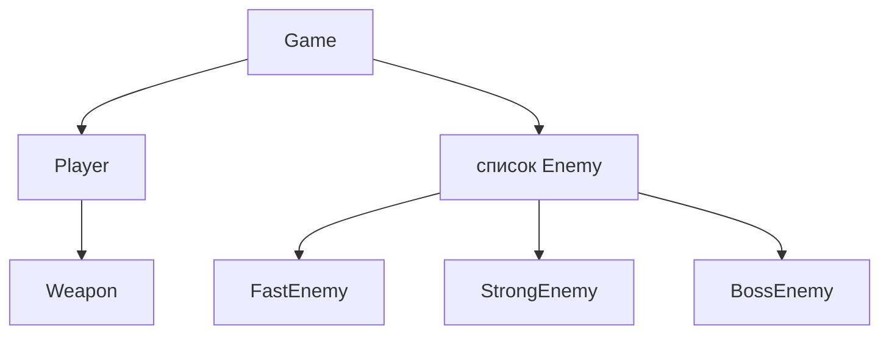

# Урок 30. 🐉 Boss — OOP Arena

**Тривалість:** 60–90 хв або 2 заняття  
**Рівень:** OOP Explorer

## 🎯 Місія
Закріпи класи, методи, композицію й наслідування у завершеній грі.

## 🧠 Ключова ідея
```text
Player → Weapon
Enemy → FastEnemy / StrongEnemy / BossEnemy
Game → enemies, score, lives
```

## 💡 Пояснення простою мовою
Це **фінальний бос** уроків — збираємо все разом. Гравець має зброю (композиція), вороги мають різні типи (наслідування), а гра керує всім (основний цикл). Як фінальний рівень у грі!

## 🧩 Розбираємо по рядках
```text
Player → Weapon     — композиція: гравець "має" зброю
Enemy → FastEnemy   — наслідування: FastEnemy "є" Enemy
                  StrongEnemy
                  BossEnemy
Game → enemies      — клас Game керує списком ворогів, score, lives
```



## 🔎 Приклад: запускай і дивись
```python
class Weapon:
    def __init__(self, name, damage):
        self.name = name
        self.damage = damage

class Player:
    def __init__(self, name, weapon):
        self.name = name
        self.weapon = weapon
        self.hp = 100

    def attack(self, enemy):
        enemy.hp -= self.weapon.damage
        print(f"{self.name} б'є {self.weapon.name} → {enemy.name}: {enemy.hp} HP")

class Enemy:
    def __init__(self, name, hp):
        self.name = name
        self.hp = hp

class FastEnemy(Enemy):
    def __init__(self):
        super().__init__("FastBat", 30)

sword = Weapon("Меч", 25)
hero = Player("Marko", sword)
bat = FastEnemy()

hero.attack(bat)   # Marko б'є Меч → FastBat: 5 HP
```

## ✏️ Основні завдання
1. Player + Weapon.
   🙋 *Підказка:* Об'єднай класи з уроків 22 та 26.
2. 2+ типи Enemy.
   🙋 *Підказка:* Використай наслідування з уроку 27.
3. Collision і score.
   🙋 *Підказка:* `if player.rect.colliderect(enemy.rect): ...` та `score += 1`.
4. Game Over та restart.
   🙋 *Підказка:`if player.hp <= 0:` показуємо Game Over, а при натисканні R — перезапуск.

## ⭐ Challenge
Завершена OOP Arena: хвилі, HP, score, weapon, Boss і Game Over.

## 🧪 Перед запуском
Хоча б раз за урок спробуй **передбачити результат коду до запуску**. Після запуску порівняй прогноз із реальністю.

## 🐞 Debug Mission
Навмисно зламай одну частину програми. Прочитай traceback або спостережи неправильну поведінку, знайди причину й виправ її.

## 🏆 Boss правило
Спочатку власна спроба → маленька підказка → ще одна спроба → лише потім готовий розбір.

## ✅ Урок завершено, якщо Марко може
- пояснити головну ідею своїми словами;
- виконати основні завдання без копіювання готового рішення;
- змінити програму під нову вимогу;
- знайти й виправити хоча б одну власну помилку.

## 🏠 Домашня місія
Покращ Challenge **однією власною ідеєю**. Перед кодом сформулюй її одним реченням.

## 💡 Підказка для дорослого
Не виправляйте код одразу. Краще запитайте: **«Що ти очікував? Що сталося? Який рядок за це відповідає? Що можна перевірити?»**
