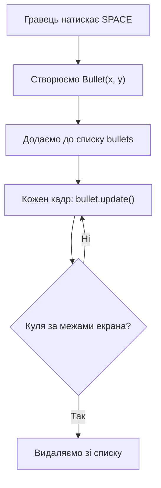

# Урок 32. Space Invaders 2 — постріли

**Тривалість:** 45–60 хв
**Рівень:** Game Developer

## 🎯 Місія
Створи `Bullet` і список пострілів.

## 🧠 Ключова ідея
```python
class Bullet:
    def __init__(self, x, y):
        self.rect = pygame.Rect(x, y, 6, 15)
        self.speed = 8

    def update(self):
        self.rect.y -= self.speed
```

## 💡 Пояснення простою мовою
Куля — це маленький прямокутник, який кожен кадр «літає» вгору. Ми зберігаємо всі кулі у списку, щоб рухати і малювати їх разом.

> **💡 Аналогія:** Куля — це як повітряна куля, прив'язана до мотузки. Поки вона на екрані — ми її рухаємо. Коли вона полетіла за межі — відв'язуємо і забуваємо (видаляємо зі списку).

## 🧩 Розбираємо по рядках
- `self.rect = pygame.Rect(x, y, 6, 15)` — куля 6 пікселів завширшки і 15 заввишки;
- `self.rect.y -= self.speed` — кожен кадр куля рухається на 8 пікселів **вгору** (мінус, бо y росте вниз).

## Життєвий цикл кулі



## ✏️ Основні завдання
1. SPACE створює Bullet.
   🙋 Підказка: лови подію `pygame.KEYDOWN` з `event.key == pygame.K_SPACE` та створюй `Bullet(player.rect.centerx, player.rect.top)`.
2. Зберігай bullets у списку.
   🙋 Підказка: `bullets = []`, а при пострілі `bullets.append(new_bullet)`.
3. Рухай усі кулі.
   🙋 Підказка: цикл `for bullet in bullets: bullet.update()` кожен кадр.
4. Видаляй кулі за екраном.
   🙋 Підказка: якщо `bullet.rect.bottom < 0` — видаляй. Але не змінюй список під час циклу — збирай «непотрібні» окремо.

## ⭐ Challenge
Додай cooldown між пострілами.

## 🧪 Перед запуском
Хоча б раз за урок спробуй **передбачити результат коду до запуску**. Після запуску порівняй прогноз із реальністю.

## 🐞 Debug Mission
Навмисно зламай одну частину програми. Прочитай traceback або спостережи неправильну поведінку, знайди причину й виправ її.

## ✅ Урок завершено, якщо Марко може
- пояснити головну ідею своїми словами;
- виконати основні завдання без копіювання готового рішення;
- змінити програму під нову вимогу;
- знайти й виправити хоча б одну власну помилку.

## 🏠 Домашня місія
Покращ Challenge **однією власною ідеєю**. Перед кодом сформулюй її одним реченням.

## 💡 Підказка для дорослого
Не виправляйте код одразу. Краще запитайте: **«Що ти очікував? Що сталося? Який рядок за це відповідає? Що можна перевірити?»**
