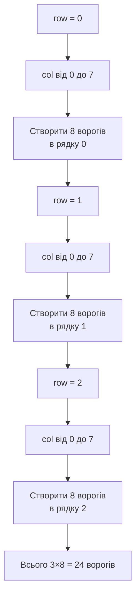

# Урок 33. Space Invaders 3 — формація ворогів

**Тривалість:** 45–60 хв
**Рівень:** Game Developer

## 🎯 Місія
Створи клас `Enemy` та формацію прибульців.

## 🧠 Ключова ідея
```python
enemies = []
for row in range(3):
    for col in range(8):
        enemies.append(Enemy(80 + col * 70, 60 + row * 60))
```

## 💡 Пояснення простою мовою
Ми малюємо ворогів як сітку — рядки й стовпчики, як клітинки таблиці. Зовнішній цикл робить рядки, внутрішній — стовпчики в кожному рядку.

> **💡 Аналогія:** Уяви парти в класі. Зовнішній цикл — це ряди парт (1-й, 2-й, 3-й). Внутрішній цикл — це учні в кожному ряді (1-й, 2-й, ... 8-й). Кожна «парта» — це один ворог.

## 🧩 Розбираємо по рядках
- `for row in range(3)` — 3 рядки ворогів;
- `for col in range(8)` — 8 ворогів у кожному рядку;
- `80 + col * 70` — кожен наступний ворог правіше на 70 пікселів (починаючи з 80);
- `60 + row * 60` — кожен наступний рядок нижче на 60 пікселів.

## Як працюють вкладені цикли



## ✏️ Основні завдання
1. Створи Enemy.
   🙋 Підказка: клас `Enemy` схожий на `Player`, тільки `rect` створюється з переданих x, y.
2. Побудуй 3×8 формацію.
   🙋 Підказка: використай два вкладених цикли `for row in range(3)` і `for col in range(8)`.
3. Намалюй їх.
   🙋 Підказка: цикл `for enemy in enemies:` і `pygame.draw.rect` для кожного.
4. Параметризуй rows/columns.
   🙋 Підказка: винеси `rows = 3` і `cols = 8` у змінні на початку файлу.

## ⭐ Challenge
Формація має створюватися функцією за `rows` і `columns`.

## 🧪 Перед запуском
Хоча б раз за урок спробуй **передбачити результат коду до запуску**. Після запуску порівняй прогноз із реальністю.

## 🐞 Debug Mission
Навмисно зламай одну частину програми. Прочитай traceback або спостережи неправильну поведінку, знайди причину й виправ її.

## ✅ Урок завершено, якщо Марко може
- пояснити головну ідею своїми словами;
- виконати основні завдання без копіювання готового рішення;
- змінити програму під нову вимогу;
- знайти й виправити хоча б одну власну помилку.

## 🏠 Домашня місія
Покращ Challenge **однією власною ідеєю**. Перед кодом сформулюй її одним реченням.

## 💡 Підказка для дорослого
Не виправляйте код одразу. Краще запитайте: **«Що ти очікував? Що сталося? Який рядок за це відповідає? Що можна перевірити?»**
