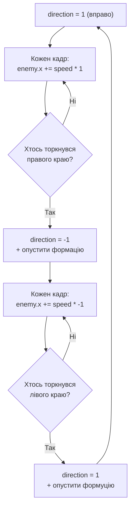

# Урок 34. Space Invaders 4 — рух формації

**Тривалість:** 45–60 хв
**Рівень:** Game Developer

> **📖 Словник:** *формація* (англ. *"formation"*) — група ворогів (шеренга / стрій / бойове шикування), які рухаються та вибудовуються як єдине ціле.

## 🎯 Місія
Навчи всю формацію рухатися як єдине ціле.

## 🧠 Ключова ідея
```python
direction = 1
for enemy in enemies:
    enemy.rect.x += enemy_speed * direction
```

## 💡 Пояснення простою мовою
Усі вороги рухаються в один бік, поки хтось не торкнеться краю. Тоді `direction` змінюється на протилежний і формація рушає інакше.

> **💡 Аналогія:** Уяви шкільну чергу на обід. Усі йдуть вправо, поки перший не впирається в стіну. Тоді черга розвертається і йде вліво.

## 🧩 Розбираємо по рядках
- `direction = 1` — 1 означає «вправо», -1 — «вліво»;
- `enemy.rect.x += enemy_speed * direction` — кожен кадр кожен ворог зсувається на `enemy_speed` пікселів у бік `direction`.

## Як працює розворот формації



## ✏️ Основні завдання
1. Рух горизонтально.
   🙋 Підказка: цикл `for enemy in enemies` і додавання `enemy_speed` до `x`.
2. На краю зміни напрямок.
   🙋 Підказка: перевір `enemy.rect.right >= 800` або `enemy.rect.left <= 0` для будь-якого ворога.
3. Опусти формуцію.
   🙋 Підказка: при розвороті додай `enemy.rect.y += 30` до кожного ворога.
4. Прискорюй при меншій кількості ворогів.
   🙋 Підказка: `enemy_speed = base_speed + (total - len(enemies)) * 0.3`.

## ⭐ Challenge
Вороги прискорюються, коли їх стає мало.

## 🧪 Перед запуском
Хоча б раз за урок спробуй **передбачити результат коду до запуску**. Після запуску порівняй прогноз із реальністю.

## 🐞 Debug Mission
Навмисно зламай одну частину програми. Прочитай traceback або спостережи неправильну поведінку, знайди причину й виправ її.

## ✅ Урок завершено, якщо Марко може
- пояснити головну ідею своїми словами;
- виконати основні завдання без копіювання готового рішення;
- змінити програму під нову вимогу;
- знайти й виправити хоча б одну власну помилку.

## 🏠 Домашня місія
Покращ Challenge **однією власною ідеєю**. Перед кодом сформулюй її одним реченням.

## 💡 Підказка для дорослого
Не виправляйте код одразу. Краще запитайте: **«Що ти очікував? Що сталося? Який рядок за це відповідає? Що можна перевірити?»**
