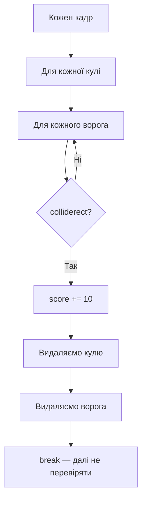

# Урок 35. Space Invaders 5 — Bullet → Enemy

**Тривалість:** 45–60 хв
**Рівень:** Game Developer

## 🎯 Місія
Реалізуй попадання кулі у ворога.

## 🧠 Ключова ідея
```python
if bullet.rect.colliderect(enemy.rect):
    score += 10
```

## 💡 Пояснення простою мовою
Кожен кадр ми перевіряємо: «чи куля торкнулася ворога?» Якщо так — додаємо очки, видаляємо кулю і ворога.

> **💡 Аналогія:** Це як у настільній грі: кидаєш м'ячик і перевіряєш, чи потрапив у ціль. Якщо потрапив — забираєш ціль з поля.

## 🧩 Розбираємо по рядках
- `bullet.rect.colliderect(enemy.rect)` — метод `Rect` перевіряє, чи перетинаються два прямокутники;
- `score += 10` — якщо так, додаємо 10 очок.

## Як працює зіткнення кулі з ворогом



## ✏️ Основні завдання
1. Collision bullet/enemy.
   🙋 Підказка: вкладені цикли — по кожній кулі й кожному ворогу. Або `enemy.rect.colliderect(bullet.rect)`.
2. Видали кулю.
   🙋 Підказка: `bullets.remove(bullet)` або збирай «вбиті» кулі в окремий список.
3. Пошкодь/видали ворога.
   🙋 Підказка: для початку просто `enemies.remove(enemy)`.
4. Додай score.
   🙋 Підказка: змінна `score = 0` на початку, `score += 10` при зіткненні, виводь через `font.render`.

## ⭐ Challenge
Додай ворога з 2 HP.

## 🧪 Перед запуском
Хоча б раз за урок спробуй **передбачити результат коду до запуску**. Після запуску порівняй прогноз із реальністю.

## 🐞 Debug Mission
Навмисно зламай одну частину програми. Прочитай traceback або спостережи неправильну поведінку, знайди причину й виправ її.

## ✅ Урок завершено, якщо Марко може
- пояснити головну ідею своїми словами;
- виконати основні завдання без копіювання готового рішення;
- змінити програму під нову вимогу;
- знайти й виправити хоча б одну власну помилку.

## 🏠 Домашня місія
Покращ Challenge **однією власною ідеєю**. Перед кодом сформулюй її одним реченням.

## 💡 Підказка для дорослого
Не виправляйте код одразу. Краще запитайте: **«Що ти очікував? Що сталося? Який рядок за це відповідає? Що можна перевірити?»**
