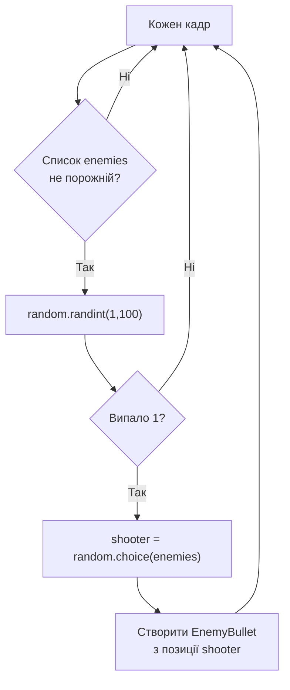

# Урок 36. Space Invaders 6 — вороги стріляють

**Тривалість:** 45–60 хв
**Рівень:** Game Developer

## 🎯 Місія
Додай ворожі постріли та небезпеку для гравця.

## 🧠 Ключова ідея
```python
if enemies and random.randint(1, 100) == 1:
    shooter = random.choice(enemies)
```

## 💡 Пояснення простою мовою
Кожен кадр ми кидаємо «кості»: якщо випало число 1 зі 100 — один випадковий ворог стріляє. Це робить гру непередбачуваною.

> **💡 Аналогія:** Уяви, що 24 вороги по черзі кидають м'ячі. Кожен кадр кожен може кинути, але шанс малий — 1 з 100. Тож м'ячі летітимуть час від часу, а не постійно.

## 🧩 Розбираємо по рядках
- `random.randint(1, 100)` — випадкове число від 1 до 100;
- `== 1` — постріл тільки якщо випало саме 1 (шанс 1%);
- `random.choice(enemies)` — обираємо випадкового ворога зі списку;
- `if enemies and ...` — перевірка, що список ворогів не порожній (інакше `random.choice` помилиться).

## Як працює випадковий ворожий постріл



## ✏️ Основні завдання
1. Створи EnemyBullet.
   🙋 Підказка: клас схожий на `Bullet`, але `rect.y` збільшується (куля летить **вниз**).
2. Випадково обирай shooter.
   🙋 Підказка: `random.choice(enemies)` обере одного випадкового ворога.
3. Рухай вниз.
   🙋 Підказка: `self.rect.y += self.speed` (плюс, бо y росте вниз).
4. Частота залежить від level.
   🙋 Підказка: замість `100` використай `max(20, 100 - level * 10)` — чим вищий level, тим частіше стріляють.

## ⭐ Challenge
Частота ворожого вогню росте з level.

## 🧪 Перед запуском
Хоча б раз за урок спробуй **передбачити результат коду до запуску**. Після запуску порівняй прогноз із реальністю.

## 🐞 Debug Mission
Навмисно зламай одну частину програми. Прочитай traceback або спостережи неправильну поведінку, знайди причину й виправ її.

## ✅ Урок завершено, якщо Марко може
- пояснити головну ідею своїми словами;
- виконати основні завдання без копіювання готового рішення;
- змінити програму під нову вимогу;
- знайти й виправити хоча б одну власну помилку.

## 🏠 Домашня місія
Покращ Challenge **однією власною ідеєю**. Перед кодом сформулюй її одним реченням.

## 💡 Підказка для дорослого
Не виправляйте код одразу. Краще запитайте: **«Що ти очікував? Що сталося? Який рядок за це відповідає? Що можна перевірити?»**
