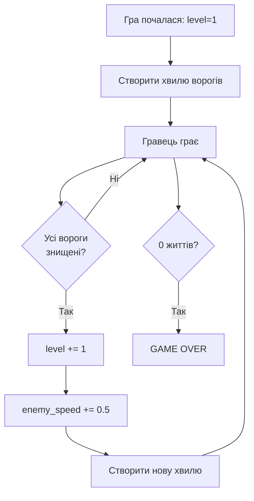

# Урок 38. Space Invaders 8 — рівні та складність

**Тривалість:** 45–60 хв
**Рівень:** Game Developer

## 🎯 Місія
Створи рівні й поступове зростання складності.

## 🧠 Ключова ідея
```python
if not enemies:
    level += 1
    enemy_speed += 0.5
    create_wave()
```

## 💡 Пояснення простою мовою
Коли гравець знищив усіх ворогів — починається нова хвиля. Вороги стають швидшими, і може з'явитися щось нове.

> **💡 Аналогія:** Як у грі « тематичний парк»: кожен рівень — нова хвиля відвідувачів, і вони стають «вимогливішими». Ти не зупиняєшся — просто робиш складніше.

## 🧩 Розбираємо по рядках
- `if not enemies:` — якщо список порожній (всі вбиті);
- `level += 1` — переходимо на наступний рівень;
- `enemy_speed += 0.5` — вороги стають швидшими;
- `create_wave()` — створюємо нову формуцію ворогів.

## Потік рівнів



## ✏️ Основні завдання
1. Створи `create_wave()`.
   🙋 Підказка: винеси код створення формації з уроку 33 у функцію `def create_wave():`.
2. Нова хвиля після перемоги.
   🙋 Підказка: перевіряй `if not enemies:` кожен кадр після оновлення.
3. Підвищуй speed.
   🙋 Підказка: `enemy_speed += 0.5` при кожному новому level.
4. Кожен 5-й рівень зроби особливим.
   🙋 Підказка: `if level % 5 == 0:` — додай щось особливе (більше ворогів, Boss).

## ⭐ Challenge
Кожен п'ятий рівень — Boss.

## 🧪 Перед запуском
Хоча б раз за урок спробуй **передбачити результат коду до запуску**. Після запуску порівняй прогноз із реальністю.

## 🐞 Debug Mission
Навмисно зламай одну частину програми. Прочитай traceback або спостережи неправильну поведінку, знайди причину й виправ її.

## ✅ Урок завершено, якщо Марко може
- пояснити головну ідею своїми словами;
- виконати основні завдання без копіювання готового рішення;
- змінити програму під нову вимогу;
- знайти й виправити хоча б одну власну помилку.

## 🏠 Домашня місія
Покращ Challenge **однією власною ідеєю**. Перед кодом сформулюй її одним реченням.

## 💡 Підказка для дорослого
Не виправляйте код одразу. Краще запитайте: **«Що ти очікував? Що сталося? Який рядок за це відповідає? Що можна перевірити?»**
