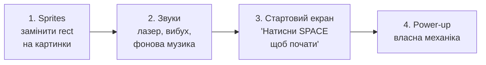

# Урок 39. Space Invaders 9 — sprites, звук і polish

**Тривалість:** 45–60 хв
**Рівень:** Game Developer

## 🎯 Місія
Додай sprites, звуки, стартовий екран і власну механіку.

## 🧠 Ключова ідея
```python
laser_sound = pygame.mixer.Sound("assets/laser.wav")
laser_sound.play()
```

## 💡 Пояснення простою мовою
Після того як гра працює — треба зробити її красивою та приємною. Sprites замінюють квадрати на картинки, а звуки роблять гру «живою».

> **💡 Аналогія:** Як прикрасити літак-паперець: спочатку зібрав, а потім розфарбував, додав стікери та зробив «вввж-вввж» звуками. Тепер він не просто літає — він **вражає**.

## 🧩 Розбираємо по рядках
- `pygame.mixer.Sound("assets/laser.wav")` — завантажуємо звуковий файл;
- `.play()` — програємо звук один раз.

## Порядок дій у цьому уроці



## ✏️ Основні завдання
1. Додай sprites.
   🙋 Підказка: створи папку `assets/`, поклади туди PNG-картинки. Завантажуй через `pygame.image.load(...).convert_alpha()`.
2. Додай звуки.
   🙋 Підказка: `laser_sound = pygame.mixer.Sound("assets/laser.wav")` і `.play()` при пострілі.
3. Стартовий екран.
   🙋 Підказка: до початку game loop покажи текст "Press SPACE to start" і чекай подію `K_SPACE`.
4. Власний power-up.
   🙋 Підказка: подумай, що цікавого може трапитися — швидша стрільба, щит, подвійна куля?

## ⭐ Challenge
Додай shield, rapid fire або інший power-up.

## 🧪 Перед запуском
Хоча б раз за урок спробуй **передбачити результат коду до запуску**. Після запуску порівняй прогноз із реальністю.

## 🐞 Debug Mission
Навмисно зламай одну частину програми. Прочитай traceback або спостережи неправильну поведінку, знайди причину й виправ її.

## ✅ Урок завершено, якщо Марко може
- пояснити головну ідею своїми словами;
- виконати основні завдання без копіювання готового рішення;
- змінити програму під нову вимогу;
- знайти й виправити хоча б одну власну помилку.

## 🏠 Домашня місія
Покращ Challenge **однією власною ідеєю**. Перед кодом сформулюй її одним реченням.

## 💡 Підказка для дорослого
Не виправляйте код одразу. Краще запитайте: **«Що ти очікував? Що сталося? Який рядок за це відповідає? Що можна перевірити?»**
