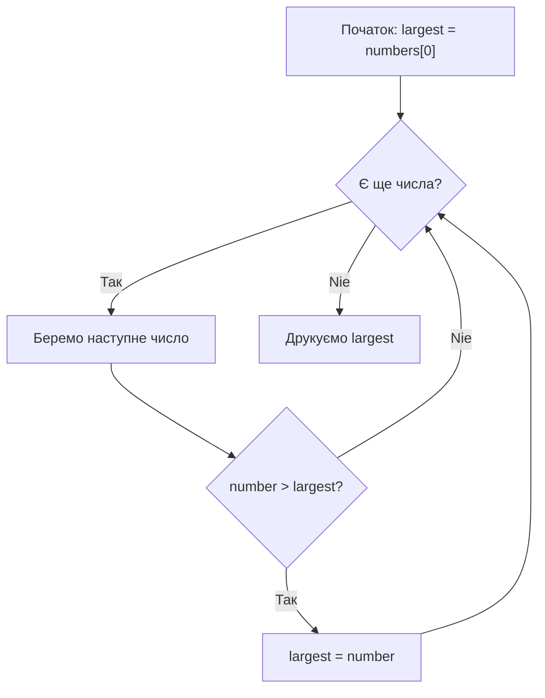

# Урок 41. Алгоритми — що це таке?

**Тривалість:** 45–60 хв  
**Рівень:** Algorithm Explorer

## 🎯 Місія
Зрозумій алгоритм як точну послідовність дій.

## 🧠 Ключова ідея
```python
numbers = [7, 2, 9, 4, 1]
largest = numbers[0]
for number in numbers:
    if number > largest:
        largest = number
```

## 💡 Пояснення простою мовою
Алгоритм — це як рецепт для піци: крок за кроком, без пропусків. Тут ми шукаємо найбільше число, обходячи список і порівнюючи кожне число з поточним чемпіоном.

## 🧩 Розбираємо по рядках
- `largest = numbers[0]` — перше число стає "чемпіоном" (поки що найбільшим)
- `for number in numbers` — ми дивимося на кожне число по черзі
- `if number > largest` — якщо нове число більше за чемпіона...
- `largest = number` — ...воно стає новим чемпіоном!

## Приклад з кроками
```python
numbers = [3, 8, 2, 9, 5]
largest = 3       # чемпіон = 3
# порівнюємо: 3<8 → чемпіон = 8
# порівнюємо: 8>2 → чемпіон = 8
# порівнюємо: 8<9 → чемпіон = 9
# порівнюємо: 9>5 → чемпіон = 9
print(largest)    # 9
```



## ✏️ Основні завдання
1. Максимум без `max()`.
2. Мінімум без `min()`.
3. Сума без `sum()`.
4. Другий максимум.

🙋 Підказка до завдання 2: замість `>` використай `<`. Або спочатку скопіюй список і видаляй максимум!

## ⭐ Challenge
Знайди друге найбільше число без сортування.

## 🧪 Перед запуском
Хоча б раз за урок спробуй **передбачити результат коду до запуску**. Після запуску порівняй прогноз із реальністю.

## 🐞 Debug Mission
Навмисно зламай одну частину програми. Прочитай traceback або спостережи неправильну поведінку, знайди причину й виправ її.

## ✅ Урок завершено, якщо Марко може
- пояснити головну ідею своїми словами;
- виконати основні завдання без копіювання готового рішення;
- змінити програму під нову вимогу;
- знайти й виправити хоча б одну власну помилку.

## 🏠 Домашня місія
Покращ Challenge **однією власною ідеєю**. Перед кодом сформулюй її одним реченням.

## 💡 Підказка для дорослого
Не виправляйте код одразу. Краще запитайте: **«Що ти очікував? Що сталося? Який рядок за це відповідає? Що можна перевірити?»**
