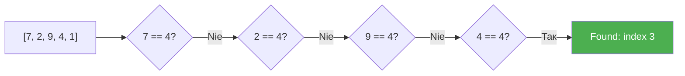

# Урок 42. Лінійний пошук

**Тривалість:** 45–60 хв  
**Рівень:** Algorithm Explorer

## 🎯 Місія
Реалізуй пошук елемента без `.index()`.

## 🧠 Ключова ідея
```python
for i in range(len(items)):
    if items[i] == target:
        print("Found:", i)
        break
```

## 💡 Пояснення простою мовою
Лінійний пошук — це як шукати ключ у кишенях пальта: перевіряєш кишеню за кишенею, поки не знайдеш. Список перевіряється елемент за елементом зліва направо.

## 🧩 Розбираємо по рядках
- `for i in range(len(items))` — проходимо по кожному індексу (0, 1, 2, ...)
- `if items[i] == target` — чи цей елемент той, що шукаємо?
- `print("Found:", i)` — якщо так — друкуємо його позицію
- `break` — зупиняємося, бо знайшли!

## Приклад: шукаємо число 4
```python
items = [7, 2, 9, 4, 1]
target = 4

for i in range(len(items)):
    print(f"Перевіряю items[{i}] = {items[i]}")
    if items[i] == target:
        print("Found:", i)
        break
# Вивід: items[0]=7, items[1]=2, items[2]=9, items[3]=4 → Found: 3
```



## ✏️ Основні завдання
1. Знайди число.
2. Поверни індекс.
3. Оброби Not found.
4. Порахуй перевірки.

🙋 Підказка до завдання 3: якщо цикл закінчився, а `target` не знайдений — поверни `-1` або виведи повідомлення.

## ⭐ Challenge
Напиши `find_item(items, target)` без `.index()`.

## 🧪 Перед запуском
Хоча б раз за урок спробуй **передбачити результат коду до запуску**. Після запуску порівняй прогноз із реальністю.

## 🐞 Debug Mission
Навмисно зламай одну частину програми. Прочитай traceback або спостережи неправильну поведінку, знайди причину й виправ її.

## ✅ Урок завершено, якщо Марко може
- пояснити головну ідею своїми словами;
- виконати основні завдання без копіювання готового рішення;
- змінити програму під нову вимогу;
- знайти й виправити хоча б одну власну помилку.

## 🏠 Домашня місія
Покращ Challenge **однією власною ідеєю**. Перед кодом сформулюй її одним реченням.

## 💡 Підказка для дорослого
Не виправляйте код одразу. Краще запитайте: **«Що ти очікував? Що сталося? Який рядок за це відповідає? Що можна перевірити?»**
