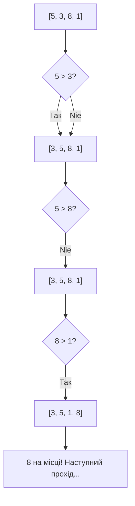

# Урок 43. Сортування своїми руками

**Тривалість:** 45–60 хв  
**Рівень:** Algorithm Explorer

## 🎯 Місія
Зрозумій сортування, реалізувавши простий алгоритм вручну.

## 🧠 Ключова ідея
```python
for i in range(len(numbers)):
    for j in range(len(numbers) - 1):
        if numbers[j] > numbers[j + 1]:
            numbers[j], numbers[j + 1] = numbers[j + 1], numbers[j]
```

## 💡 Пояснення простою мовою
Це Bubble Sort — "пухирчате" сортування. Уяви, що найбільші числа "спливають" нагору, як повітряні бульбашки у воді. Ми порівнюємо два сусідні числа і міняємо їх місцями, якщо вони не в правильному порядку.

## 🧩 Розбираємо по рядках
- `for i in range(len(numbers))` — зовнішній цикл: скільки разів проходимо по списку
- `for j in range(len(numbers) - 1)` — внутрішній цикл: порівнюємо сусідів
- `if numbers[j] > numbers[j + 1]` — лівий більший за правий?
- `numbers[j], numbers[j + 1] = numbers[j + 1], numbers[j]` — міняємо місцями!

## Приклад: перший прохід
```python
numbers = [5, 3, 8, 1]
# Порівнюємо: 5>3 → міняємо → [3, 5, 8, 1]
# Порівнюємо: 5<8 → OK    → [3, 5, 8, 1]
# Порівнюємо: 8>1 → міняємо → [3, 5, 1, 8]
# Після 1-го проходу: 8 "спливла" на місце!
```



## ✏️ Основні завдання
1. Пройди алгоритм на папері.
2. Сортуй за зростанням.
3. Сортуй за спаданням.
4. Порахуй порівняння.

🙋 Підказка до завдання 3: зміни `>` на `<` у рядку порівняння.

## ⭐ Challenge
Відсортуй список гравців-словників за `score` без `sorted()`.

## 🧪 Перед запуском
Хоча б раз за урок спробуй **передбачити результат коду до запуску**. Після запуску порівняй прогноз із реальністю.

## 🐞 Debug Mission
Навмисно зламай одну частину програми. Прочитай traceback або спостережи неправильну поведінку, знайди причину й виправ її.

## ✅ Урок завершено, якщо Марко може
- пояснити головну ідею своїми словами;
- виконати основні завдання без копіювання готового рішення;
- змінити програму під нову вимогу;
- знайти й виправити хоча б одну власну помилку.

## 🏠 Домашня місія
Покращ Challenge **однією власною ідеєю**. Перед кодом сформулюй її одним реченням.

## 💡 Підказка для дорослого
Не виправляйте код одразу. Краще запитайте: **«Що ти очікував? Що сталося? Який рядок за це відповідає? Що можна перевірити?»**
