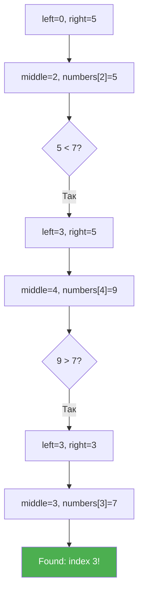

# Урок 44. Бінарний пошук

**Тривалість:** 45–60 хв  
**Рівень:** Algorithm Explorer

## 🎯 Місія
Навчися відкидати половину варіантів у відсортованому списку.

## 🧠 Ключова ідея
```python
left = 0
right = len(numbers) - 1

while left <= right:
    middle = (left + right) // 2
    # порівняй numbers[middle] з target
```

## 💡 Пояснення простою мовою
Бінарний пошук — це як гра "більше-менше": ти кажеш "50", комп'ютер каже "більше" — і ти вже не дивишся на ліву половину. За кожен крок відкидаємо половину варіантів!

## 🧩 Розбираємо по рядках
- `left = 0, right = len(numbers) - 1` — межі пошуку: від першого до останнього
- `while left <= right` — поки є що перевіряти
- `middle = (left + right) // 2` — знаходимо середину (ціле ділення)
- Далі порівнюємо `numbers[middle]` з `target` і звужуємо межі

## Приклад: шукаємо 7 у відсортованому списку
```python
numbers = [1, 3, 5, 7, 9, 11]
target = 7

# left=0, right=5, middle=2 → numbers[2]=5 < 7 → left=3
# left=3, right=5, middle=4 → numbers[4]=9 > 7 → right=3
# left=3, right=3, middle=3 → numbers[3]=7 == 7 → Found!
# Всього 3 перевірки замість 6!
```



## ✏️ Основні завдання
1. Знайди middle.
2. Змінюй left/right.
3. Оброби Not found.
4. Порівняй перевірки з linear search.

🙋 Підказка до завдання 3: якщо `left > right` — елемента немає у списку.

## ⭐ Challenge
Напиши `binary_search()` і порівняй кількість перевірок із linear search.

## 🧪 Перед запуском
Хоча б раз за урок спробуй **передбачити результат коду до запуску**. Після запуску порівняй прогноз із реальністю.

## 🐞 Debug Mission
Навмисно зламай одну частину програми. Прочитай traceback або спостережи неправильну поведінку, знайди причину й виправ її.

## ✅ Урок завершено, якщо Марко може
- пояснити головну ідею своїми словами;
- виконати основні завдання без копіювання готового рішення;
- змінити програму під нову вимогу;
- знайти й виправити хоча б одну власну помилку.

## 🏠 Домашня місія
Покращ Challenge **однією власною ідеєю**. Перед кодом сформулюй її одним реченням.

## 💡 Підказка для дорослого
Не виправляйте код одразу. Краще запитайте: **«Що ти очікував? Що сталося? Який рядок за це відповідає? Що можна перевірити?»**
