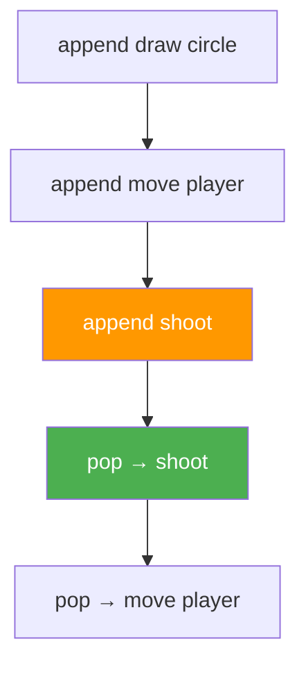

# Урок 46. Stack — Undo

**Тривалість:** 45–60 хв  
**Рівень:** Algorithm Explorer

## 🎯 Місія
Познайомся зі стеком через систему Undo.

## 🧠 Ключова ідея
```python
stack = []
stack.append("draw circle")
stack.append("move player")
last_action = stack.pop()
```

## 💡 Пояснення простою мовою
Стек — це як стос тарілок: кладеш зверху (append), забираєш зверху (pop). Останнє, що ти поклав — перше, що візьмеш. Це називається LIFO (Last In — First Out).

## 🧩 Розбираємо по рядках
- `stack = []` — порожній стос тарілок
- `stack.append(...)` — кладемо тарілку зверху
- `stack.pop()` — забираємо верхню тарілку

## Приклад: система Undo
```python
stack = []
stack.append("Намалювати коло")
stack.append("Рух гравця")
stack.append("Стріляти")
print(stack[-1])          # Стріляти (остання дія)

undone = stack.pop()     # Забрали: Стріляти
print(stack[-1])          # Рух гравця (тепер остання)
```



## ✏️ Основні завдання
1. Стек із 5 дій.
2. Undo через `.pop()`.
3. Оброби пустий stack.
4. Покажи верхню дію.

🙋 Підказка до завдання 3: спробуй `pop()` на порожньому стеку — буде помилка! Використай `if stack:` перед `pop()`.

## ⭐ Challenge
Створи просту систему Undo.

## 🧪 Перед запуском
Хоча б раз за урок спробуй **передбачити результат коду до запуску**. Після запуску порівняй прогноз із реальністю.

## 🐞 Debug Mission
Навмисно зламай одну частину програми. Прочитай traceback або спостережи неправильну поведінку, знайди причину й виправ її.

## ✅ Урок завершено, якщо Марко може
- пояснити головну ідею своїми словами;
- виконати основні завдання без копіювання готового рішення;
- змінити програму під нову вимогу;
- знайти й виправити хоча б одну власну помилку.

## 🏠 Домашня місія
Покращ Challenge **однією власною ідеєю**. Перед кодом сформулюй її одним реченням.

## 💡 Підказка для дорослого
Не виправляйте код одразу. Краще запитайте: **«Що ти очікував? Що сталося? Який рядок за це відповідає? Що можна перевірити?»**
