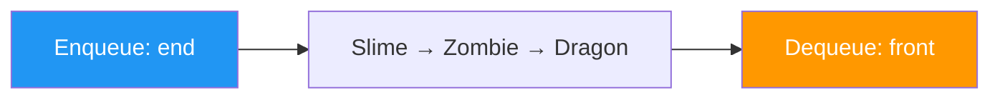

# Урок 47. Queue — черга

**Тривалість:** 45–60 хв  
**Рівень:** Algorithm Explorer

## 🎯 Місія
Познайомся з FIFO-чергою через `deque`.

## 🧠 Ключова ідея
```python
from collections import deque

queue = deque(["Slime", "Zombie", "Dragon"])
next_enemy = queue.popleft()
```

## 💡 Пояснення простою мовою
Черга — це як черга в магазині: хто прийшов першим — той і виходить першим (FIFO — First In, First Out). На відміну від стеку, де ми завжди беремо зверху.

## 🧩 Розбираємо по рядках
- `from collections import deque` — імпортуємо чергу (швидшу за звичайний список)
- `deque([...])` — створюємо чергу з елементами
- `queue.popleft()` — забираємо перший елемент (лівий)

## Приклад: черга ворогів
```python
from collections import deque

enemies = deque(["Slime", "Slime", "Zombie", "Dragon"])
while enemies:
    current = enemies.popleft()
    print(f"Б'ємо: {current}!")
# Б'ємо: Slime!
# Б'ємо: Slime!
# Б'ємо: Zombie!
# Б'ємо: Dragon!
```

## Стек vs Черга
| Стек (LIFO) | Черга (FIFO) |
|-------------|--------------|
| append + pop | append + popleft |
| Останній — перший | Перший — перший |
| Undo, history | Черга ворогів, printer |



## ✏️ Основні завдання
1. Черга ворогів.
2. Додавай у кінець.
3. Бери з початку.
4. Порівняй queue і stack.

🙋 Підказка до завдання 4: створи однакові 3 дії — одна через `append/pop`, інша через `append/popleft`. Подивись результат!

## ⭐ Challenge
Зроби систему хвиль ворогів через queue.

## 🧪 Перед запуском
Хоча б раз за урок спробуй **передбачити результат коду до запуску**. Після запуску порівняй прогноз із реальністю.

## 🐞 Debug Mission
Навмисно зламай одну частину програми. Прочитай traceback або спостережи неправильну поведінку, знайди причину й виправ її.

## ✅ Урок завершено, якщо Марко може
- пояснити головну ідею своїми словами;
- виконати основні завдання без копіювання готового рішення;
- змінити програму під нову вимогу;
- знайти й виправити хоча б одну власну помилку.

## 🏠 Домашня місія
Покращ Challenge **однією власною ідеєю**. Перед кодом сформулюй її одним реченням.

## 💡 Підказка для дорослого
Не виправляйте код одразу. Краще запитайте: **«Що ти очікував? Що сталося? Який рядок за це відповідає? Що можна перевірити?»**
