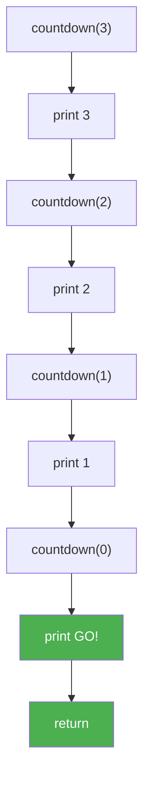

# Урок 48. Рекурсія без магії

**Тривалість:** 45–60 хв  
**Рівень:** Algorithm Explorer

## 🎯 Місія
Зрозумій рекурсію, base case і виклик функції самої себе.

## 🧠 Ключова ідея
```python
def countdown(n):
    if n == 0:
        print("GO!")
        return
    print(n)
    countdown(n - 1)
```

## 💡 Пояснення простою мовою
Рекурсія — це як лялька-матрьошка: відкриваєш одну — а всередині ще одна така ж, тільки менша. Функція викликає саму себе, поки не дістанеться до найменшої (base case).

## 🧩 Розбираємо по рядках
- `def countdown(n)` — функція приймає число
- `if n == 0` — base case: зупиняємося!
- `return` — виходимо з функції, інакше буде нескінченний цикл
- `countdown(n - 1)` — викликаємо себе з меншим числом

## Приклад: countdown(3)
```python
countdown(3)
# друкує 3, викликає countdown(2)
#   друкує 2, викликає countdown(1)
#     друкує 1, викликає countdown(0)
#       n==0 → друкує "GO!" → return
```



## ✏️ Основні завдання
1. Countdown.
2. Сума 1..n.
3. Надрукуй 1..n.
4. Навмисно зламай base case і досліди помилку.

🙋 Підказка до завдання 2: `sum_up_to(n) = n + sum_up_to(n-1)`, і base case: якщо `n == 0` поверни `0`.

## ⭐ Challenge
Зроби простий рекурсивний пошук скарбу у вкладеній структурі.

## 🧪 Перед запуском
Хоча б раз за урок спробуй **передбачити результат коду до запуску**. Після запуску порівняй прогноз із реальністю.

## 🐞 Debug Mission
Навмисно зламай одну частину програми. Прочитай traceback або спостережи неправильну поведінку, знайди причину й виправ її.

## ✅ Урок завершено, якщо Марко може
- пояснити головну ідею своїми словами;
- виконати основні завдання без копіювання готового рішення;
- змінити програму під нову вимогу;
- знайти й виправити хоча б одну власну помилку.

## 🏠 Домашня місія
Покращ Challenge **однією власною ідеєю**. Перед кодом сформулюй її одним реченням.

## 💡 Підказка для дорослого
Не виправляйте код одразу. Краще запитайте: **«Що ти очікував? Що сталося? Який рядок за це відповідає? Що можна перевірити?»**
