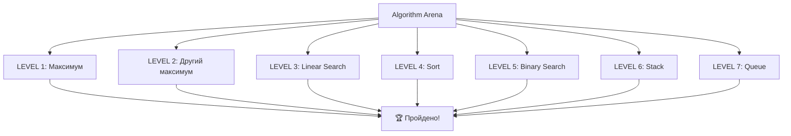

# Урок 49. Algorithm Arena

**Тривалість:** 45–60 хв  
**Рівень:** Algorithm Explorer

## 🎯 Місія
Пройди серію алгоритмічних випробувань.

## 🧠 Ключова ідея
```text
LEVEL 1 — максимум
LEVEL 2 — другий максимум
LEVEL 3 — linear search
LEVEL 4 — sort
LEVEL 5 — binary search
LEVEL 6 — stack
LEVEL 7 — queue
```

## 💡 Пояснення простою мовою
Це як арена у грі: кожен рівень — нове випробування. Ти використовуєш все, що вивчив у попередніх уроках, і б'єш "босів" (задачі) один за одним!

## Меню арени
```python
print("=== Algorithm Arena ===")
print("1 - Максимум")
print("2 - Другий максимум")
print("3 - Лінійний пошук")
print("4 - Сортування")
print("5 - Бінарний пошук")
print("6 - Стек")
print("7 - Черга")
choice = input("Обери рівень: ")
```



## ✏️ Основні завдання
1. Розв'язуй без заборонених built-ins.
2. Спочатку алгоритм словами.
3. Перевір пусті/дублікати.
4. Оформи рішення функціями.

🙋 Підказка до завдання 2: перед кодом запиши кроки українською, наприклад: "проходимо по списку, порівнюємо з чемпіоном..."

## ⭐ Challenge
Створи `algorithm_arena.py` з меню демонстрацій.

## 🧪 Перед запуском
Хоча б раз за урок спробуй **передбачити результат коду до запуску**. Після запуску порівняй прогноз із реальністю.

## 🐞 Debug Mission
Навмисно зламай одну частину програми. Прочитай traceback або спостережи неправильну поведінку, знайди причину й виправ її.

## ✅ Урок завершено, якщо Марко може
- пояснити головну ідею своїми словами;
- виконати основні завдання без копіювання готового рішення;
- змінити програму під нову вимогу;
- знайти й виправити хоча б одну власну помилку.

## 🏠 Домашня місія
Покращ Challenge **однією власною ідеєю**. Перед кодом сформулюй її одним реченням.

## 💡 Підказка для дорослого
Не виправляйте код одразу. Краще запитайте: **«Що ти очікував? Що сталося? Який рядок за це відповідає? Що можна перевірити?»**
